Blume rendert standardmäßiges Markdown und MDX mit einem kuratierten, GitHub-Flavored-Funktionsumfang — keine Imports, keine Konfiguration. Schreibe Inhalte so, wie du es ohnehin tust; diese Seite zeigt alles, was unterstützt wird, mit einer Live-Vorschau und dem Quelltext für jedes Element.

## Überschriften

Gliedere eine Seite mit Überschriften. Blume rendert den `title` aus deinem Frontmatter als Seitenüberschrift, beginne deinen Inhalt also bei `##` — `##` und `###` werden zu Einträgen im Inhaltsverzeichnis. Jede Überschrift von `##` bis `######` wird außerdem in einen Link auf ihren eigenen Anker eingefasst, sodass Leser eine Überschrift anklicken können, um einen Permalink direkt zu diesem Abschnitt zu kopieren, als Lesezeichen zu speichern oder zu teilen (mit dem Mauszeiger darüberfahren, um das `#` einzublenden). Schalte das mit `markdown: { headingAnchors: false }` in `blume.config.ts` ab.

```md
## Section

### Subsection

#### Detail
```

## Betonung

Inline-Formatierung, um Wörter hervorzuheben, Löschungen zu kennzeichnen und Code oder Tastenanschläge mitten im Satz zu zeigen.

**Fett**, _kursiv_, ~~durchgestrichen~~ und `Inline-Code`.

```md
**Bold**, _italic_, ~~strikethrough~~, and `inline code`.
```

## Hoch- und Tiefstellung

Für Fußnotenzeichen, Ordnungszahlen sowie wissenschaftliche oder chemische Notation im Fließtext.

E = mc^2^ und H~2~O.

{/* prettier-ignore */}
```md
E = mc^2^ and H~2~O.
```

## Blockzitate

Hebe ein Zitat, einen beiläufigen Hinweis oder eine redaktionelle Anmerkung vom umgebenden Text ab.

> Dokumentation, die schnell, KI-bereit und ohne Konfiguration auskommt — bis hin zum Template.

```md
> Documentation that's fast, AI-ready, and zero-config — down to the template.
```

## Listen

Verwende ungeordnete Listen für ungeordnete Mengen, geordnete Listen für Abfolgen und Aufgabenlisten für Checklisten und Roadmaps.

- Markdown-first schreiben
- Standardmäßig statisch
  - Server-Funktionen optional aktivieren
- Deine Ausgabe gehört dir

1. Blume installieren
2. Eine Seite schreiben
3. Veröffentlichen

- [x] Projekt aufsetzen
- [ ] Erste Anleitung schreiben

```md
- Markdown-first authoring
- Static by default
  - Opt into server features
- Own your output

1. Install Blume
2. Write a page
3. Ship it

- [x] Scaffold the project
- [ ] Write the first guide
```

## Tabellen

Stelle strukturierte Daten tabellarisch dar — Konfigurationsoptionen, Vergleichsmatrizen, Parameterlisten. Verwende Doppelpunkte in der Trennzeile, um Spalten auszurichten.

| Befehl        | Beschreibung             | Ausgabe |
| ------------- | ------------------------ | :-----: |
| `blume dev`   | Den Dev-Server starten   |    —    |
| `blume build` | Die statische Site bauen | `dist/` |

```md
| Command       | Description           | Output  |
| ------------- | --------------------- | :-----: |
| `blume dev`   | Start the dev server  |    —    |
| `blume build` | Build the static site | `dist/` |
```

Für eine Tabelle ohne Kopfzeile — zum Beispiel Schlüssel-Wert-Paare — lässt du die Kopfzellen leer. Markdown verlangt die Kopf- und Trennzeile syntaktisch, aber Blume entfernt den leeren Kopf aus der gerenderten Tabelle.

```md
|                |          |
| -------------- | -------- |
| Current status | E-3 visa |
```

## Links und Bilder

Verlinke auf andere Seiten oder externe Websites. Bilder akzeptieren einen relativen Pfad zu einer Datei neben deinem Inhalt, jeden Pfad unter `public/` (wird im Site-Root ausgeliefert) oder eine entfernte URL.

Lies den [Schnellstart](/docs/quickstart), um loszulegen.

```md
Read the [quickstart](/docs/quickstart) to get started.


```

**Bevorzuge relative Pfade für lokale Bilder** — sie werden beim Build optimiert: komprimiert, nach WebP konvertiert und mit intrinsischer `width`/`height` versehen, damit die Seite beim Laden nicht springt. Lege das Bild neben die Seite, die es verwendet (oder in einen gemeinsamen Ordner innerhalb deines Content-Verzeichnisses) und referenziere es relativ:

```md

```

Absolute Pfade unter `public/` (``) werden unverändert ausgeliefert, ohne Optimierung — nutze sie für Dateien, die ihre exakten Bytes und ihre URL behalten müssen, etwa ein Logo, das von außerhalb deiner Doku referenziert wird. Auch entfernte Bilder werden unangetastet durchgereicht, sofern ihr Host nicht in der [`image`-Konfiguration](/docs/configuration#images) autorisiert ist.

Inhaltsbilder sind standardmäßig per Klick zoombar — Leser können jedes Bild anklicken, um es in einer Lightbox zu öffnen. Schalte das mit `markdown: { imageZoom: false }` in `blume.config.ts` ab oder nimm ein einzelnes Bild mit `data-no-zoom` aus.

## Horizontale Linie

Trenne größere Themenwechsel innerhalb einer langen Seite.

---

```md
---
```

## Codeblöcke

Eingezäunte Codeblöcke werden syntaxhervorgehoben und erhalten eine Kopfzeile mit der Sprache — samt Markensymbol für erkannte Sprachen — sowie einen Kopieren-Button. Füge nach der Sprache einen **Titel** hinzu — typischerweise einen Dateinamen — und er ersetzt die Sprachbezeichnung in der Kopfzeile.

```ts blume.config.ts
import { defineConfig } from "blume";

export default defineConfig({
  title: "My docs",
});
```

````md
```ts blume.config.ts
import { defineConfig } from "blume";

export default defineConfig({
  title: "My docs",
});
```
````

Auch Inline-Code lässt sich hervorheben: Setze einen `{:lang}`-Marker in eine Backtick-Spanne, und sie wird wie ein winziger Codeblock eingefärbt — `useState(){:js}` oder `T extends object{:ts}`. Das greift nur, wenn du den Marker hinzufügst, sodass einfacher Inline-Code unberührt bleibt — nichts, was aktiviert werden müsste.

Die Hervorhebung nutzt standardmäßig die Themes `github-light`/`github-dark`. Tausche pro Farbmodus jedes [mitgelieferte Shiki-Theme](https://shiki.style/themes) über `markdown.codeBlocks.theme` ein — es färbt alle Code-Oberflächen auf einmal (Fences, Inline-Snippets, `<CodeBlock>` und `<Diff>`):

```ts blume.config.ts
export default defineConfig({
  markdown: {
    codeBlocks: {
      theme: { light: "github-light", dark: "vesper" },
    },
  },
});
```

Du kannst auch direkt eine eigene [Shiki-Theme-Definition](https://shiki.style/guide/load-theme) bereitstellen. Importiere eine VS-Code-kompatible Theme-JSON-Datei (mit einem Import-Attribut, falls deine Laufzeitumgebung eines verlangt) und weise sie einem der beiden Farbmodi zu; mitgelieferte Namen und eigene Definitionen lassen sich mischen:

```ts blume.config.ts
import darkTheme from "./themes/acme-dark.json" with { type: "json" };

export default defineConfig({
  markdown: {
    codeBlocks: {
      theme: { light: "github-light", dark: darkTheme },
    },
  },
});
```

### Zeilennummern

Hänge `lineNumbers` an, um eine Zeilennummernspalte zu rendern — allein oder zusammen mit einem Titel:

```ts server.ts lineNumbers
import { serve } from "blume";

serve({ port: 3000 });
```

````md
```ts server.ts lineNumbers
import { serve } from "blume";

serve({ port: 3000 });
```
````

### Hervorhebung

Versieh Code mit Kommentaren im GitHub-Stil, um Aufmerksamkeit auf Zeilen, Wörter und Änderungen zu lenken. Die Kommentare werden aus der gerenderten Ausgabe entfernt, sodass der Code sauber kopierbar bleibt. Alle vier sind standardmäßig aktiv — keine Konfiguration nötig.

Markiere eine Zeile mit `// [!code highlight]`, um ihr einen hervorgehobenen Hintergrund zu geben:

```ts
const config = defineConfig({
  title: "My docs", // [!code highlight]
});
```

Zeige Änderungen mit `// [!code ++]` für Ergänzungen und `// [!code --]` für Entfernungen, gerendert als grün/rotes Diff:

```ts
export default defineConfig({
  title: "My docs", // [!code --]
  title: "Blume docs", // [!code ++]
});
```

Hebe jedes Vorkommen eines Begriffs in einer Zeile mit `// [!code word:serve]` hervor:

```ts
import { serve } from "blume"; // [!code word:serve]

serve({ port: 3000 });
```

Blende alles außer den mit `// [!code focus]` markierten Zeilen ab (der Rest wird beim Überfahren mit der Maus wieder scharf):

```ts
export default defineConfig({
  title: "My docs", // [!code focus]
  description: "Built with Blume",
});
```

Oder hebe Zeilen per **Nummer** statt per Kommentar hervor — nützlich, wenn du den Code nicht bearbeiten kannst. Setze einen Bereich in geschweiften Klammern hinter die Sprache; einzelne Zeilen, Kommalisten und `start-end`-Spannen funktionieren alle:

```ts {1,4-5}
import { defineConfig } from "blume";

export default defineConfig({
  title: "My docs",
  description: "Built with Blume",
});
```

````md
```ts {1,4-5}
import { defineConfig } from "blume";

export default defineConfig({
  title: "My docs",
  description: "Built with Blume",
});
```
````

### Anzeigetypen

Markiere einen TypeScript-Block mit `twoslash`, um echte Typen direkt aus dem Compiler anzuzeigen — ermöglicht durch [Twoslash](https://shiki.style/packages/twoslash). Fahre über ein beliebiges Token, um seinen abgeleiteten Typ zu sehen, und füge eine Inline-Abfrage `^?` hinzu, um einen Typ unter der Zeile anzuheften.

```ts twoslash
const config = {
  title: "My docs",
  version: 1,
};

config.title;
//     ^?
```

````md
```ts twoslash
const config = { title: "My docs", version: 1 };

config.title;
//     ^?
```
````

:::note
Blende die Sprachsymbole aus oder lasse lange Zeilen umbrechen statt scrollen — mit `markdown: { code: { icons: false, wrap: true } }` in `blume.config.ts`.
:::

## Paketinstallation

Ein `package-install`-Block macht aus einem einzelnen Installationsbefehl ein Snippet mit Tabs für npm, pnpm, yarn und bun — so kopieren Leser genau den, der zu ihrem Setup passt. Wie Diagramme und Mathematik ist dies eine reine MDX-Funktion — in einer `.md`-Datei rendert der Block als schlichter Code-Fence.

```package-install
npm i blume
```

````md
```package-install
npm i blume
```
````

## Diagramme

Ein `mermaid`-Block rendert ein [Mermaid](https://mermaid.js.org)-Diagramm direkt aus Text. Der Inhalt des Fences wird unverändert an Mermaid übergeben, sodass jeder von Mermaid unterstützte Diagrammtyp hier funktioniert. Diagramme folgen dem aktiven Farbthema und werden bei einem Wechsel neu gerendert. Erstelle eines, indem du den Quelltext mit `mermaid` einzäunst:

````md
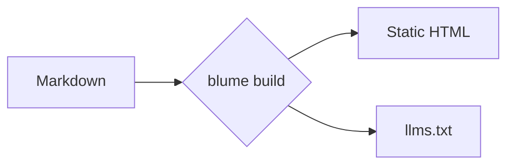
````

Diagramme werden im Client gerendert, daher ist dies eine reine MDX-Funktion, und die Mermaid-Bibliothek wird nur auf Seiten geladen, die eines enthalten. Der Rest dieses Abschnitts ist eine Galerie gängiger Typen — die vollständige Liste findest du in der [Mermaid-Dokumentation](https://mermaid.js.org/intro/).

### Flussdiagramm


### Sequenzdiagramm

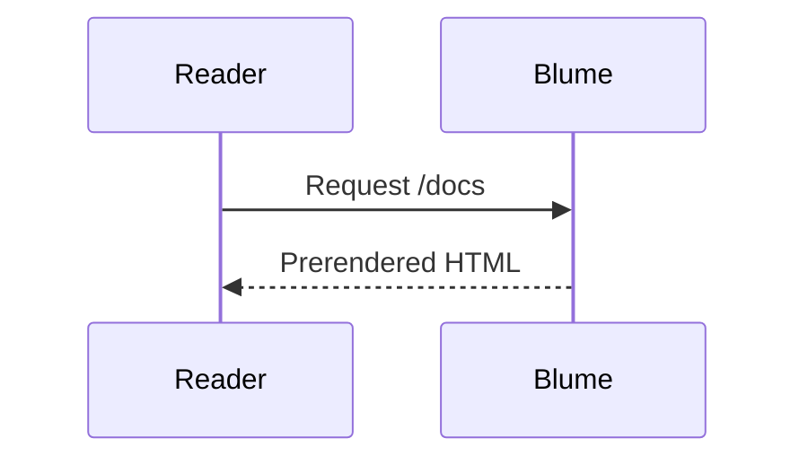

### Klassendiagramm

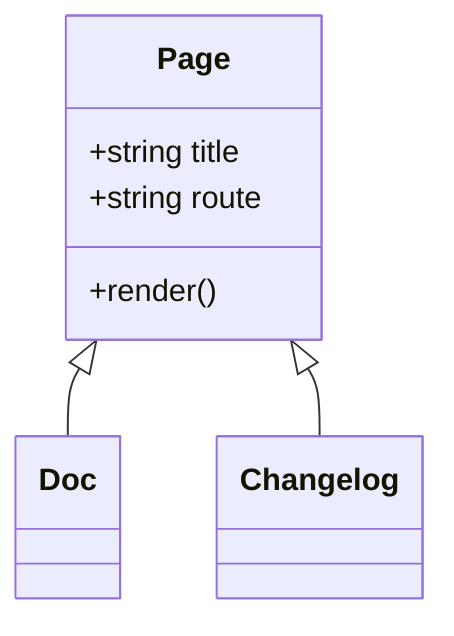

### Zustandsdiagramm

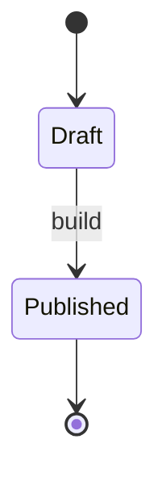

### Entity-Relationship

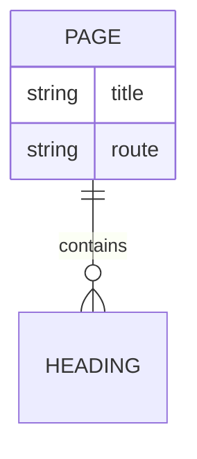

### User Journey

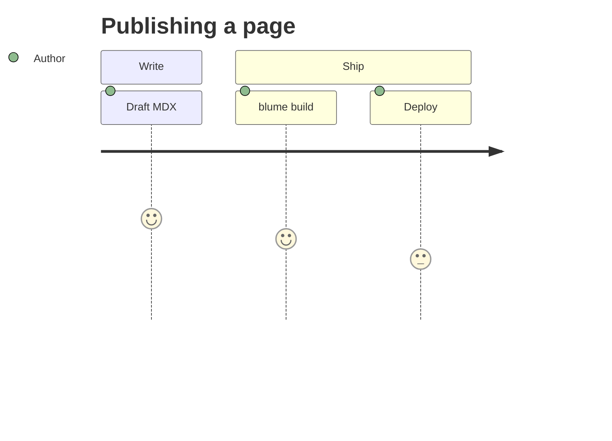

### Gantt

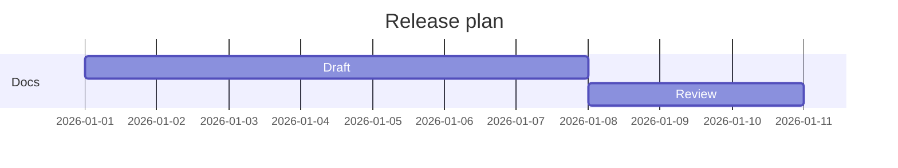

### Git-Graph

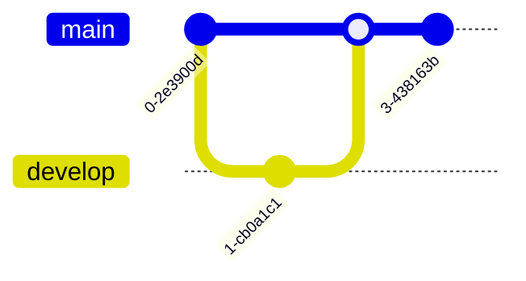

### Kreisdiagramm

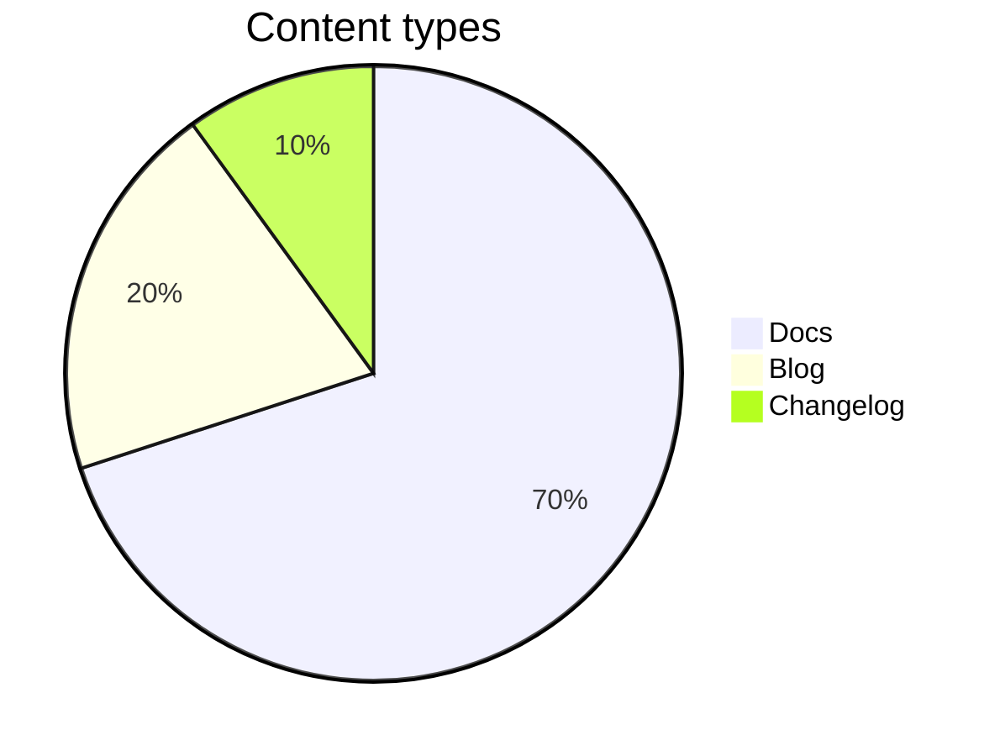

### Mindmap

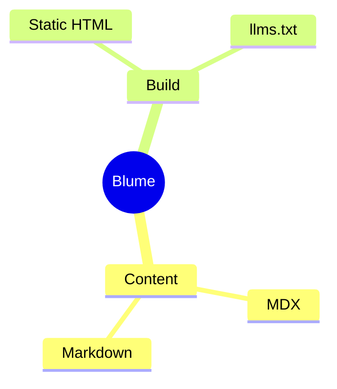

### Zeitstrahl

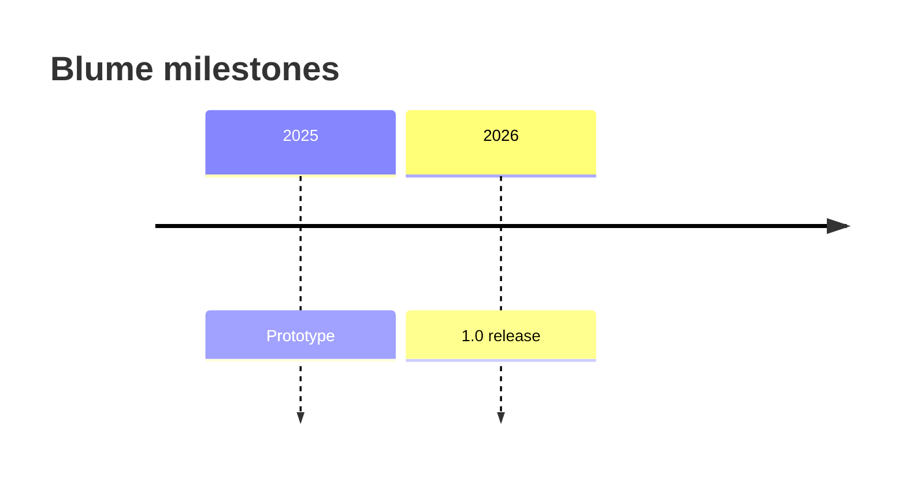

## Callouts

Callouts lenken die Aufmerksamkeit der Leser auf Kontext, Ratschläge oder Risiken. Schreibe sie als `:::type`-Direktiven; einen Titel fügst du in eckigen Klammern hinzu, etwa `:::warning[Achtung]`. Direktiven sind eine reine MDX-Funktion — in einer `.md`-Datei bleibt eine `:::note`-Zeile wörtlicher Text.

### Note

Neutraler, unterstützender Kontext, den der Leser im Hinterkopf behalten sollte.

:::note
Blume erzeugt `.blume/` bei jedem Lauf neu — bearbeite es niemals von Hand.
:::

```md
:::note
Blume regenerates `.blume/` on every run — never edit it by hand.
:::
```

### Tip

Eine hilfreiche Abkürzung oder Best Practice, die nicht erforderlich ist, das Leben aber leichter macht.

:::tip
Setze `deployment.site`, damit Sitemaps und Open-Graph-Bilder absolute URLs verwenden.
:::

```md
:::tip
Set `deployment.site` so sitemaps and Open Graph images use absolute URLs.
:::
```

### Success

Bestätige ein positives Ergebnis oder dass ein Schritt wie erwartet abgeschlossen wurde.

:::success
Deine Doku wurde erfolgreich gebaut und ist bereit zum Deployment.
:::

```md
:::success
Your docs built successfully and are ready to deploy.
:::
```

### Warning

Weise auf etwas hin, das Sorgfalt erfordert, um einen Fehler oder überraschendes Verhalten zu vermeiden.

:::warning[Achtung]
Der Wechsel zu `output: "server"` erfordert einen Adapter, bevor du deployen kannst.
:::

```md
:::warning[Heads up]
Switching to `output: "server"` requires an adapter before you can deploy.
:::
```

### Danger

Mache auf eine zerstörerische oder brechende Aktion aufmerksam, die sich nicht leicht rückgängig machen lässt.

:::danger
`blume eject` ist ein Einbahnstraßen-Schritt — das generierte Astro-Projekt gehört danach dir.
:::

```md
:::danger
`blume eject` is a one-way step — the generated Astro project becomes yours.
:::
```

### Info

Ein informativer Einschub; ein alias-freundlicher Standard, der neutral wirkt.

:::info
Das Kern-Theme liefert kein Client-Framework-JS aus.
:::

```md
:::info
The core theme ships no client framework JS.
:::
```

Die Namen `caution`, `error`, `important` und `warn` werden als Aliase für `warning`, `danger`, `note` beziehungsweise `warning` akzeptiert.

## Mathematik

Rendere LaTeX mit KaTeX als zentrierte Blöcke — nützlich für mathematik- oder naturwissenschaftslastige Dokumentation. Setze eine Formel in `$$…$$`:

$$
\int_0^\infty e^{-x^2}\,dx = \frac{\sqrt{\pi}}{2}
$$

```md
$$
a^2 + b^2 = c^2
$$
```

:::note
Mathematik gibt es nur als Block und sie ist automatisch aktiv — schreibe `$$…$$` und es wird gerendert; schreibst du keine, wird das Stylesheet von KaTeX nie ausgeliefert. Inline-Mathematik mit `$…$` gibt es nicht: Ein einzelnes `$` (Währung, Shell-Variablen, Code) bleibt immer wörtlicher Text, es gibt also kein Trennzeichen zu escapen und keine Einstellung zum Umschalten. Mathematik ist eine reine MDX-Funktion.
:::

## Intelligente Interpunktion

Blume wandelt gerade Anführungszeichen und Bindestriche schon beim Schreiben in typografische Entsprechungen um, sodass Fließtext wirkt, als wäre er gesetzt worden — ohne Sonderzeichen.

"Anführungszeichen" werden typografisch, -- wird zu einem Halbgeviertstrich, --- zu einem Geviertstrich und ... zu Auslassungspunkten.

```md
"Quotes" become curly, -- becomes an en dash, --- an em dash, and ... an ellipsis.
```
