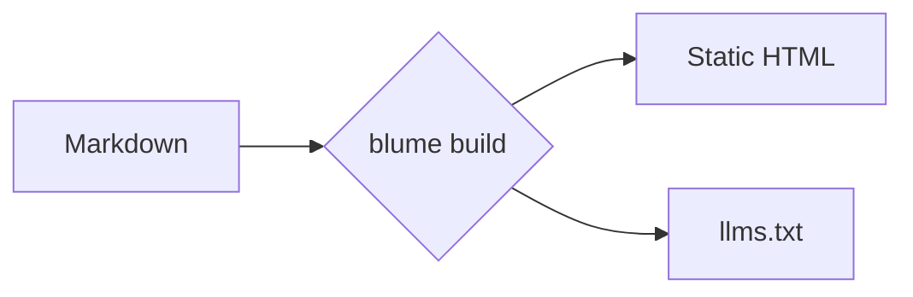

Blume renders standard Markdown and MDX with a curated, GitHub-flavored feature set — no imports, no configuration. Write content the way you already do; this page shows everything that's supported, with a live preview and the source for each.

## Headings

Structure a page with headings. Blume renders your frontmatter `title` as the page heading, so start your content at `##` — `##` and `###` become entries in the table of contents. Every `##`–`######` heading is also wrapped in a link to its own anchor, so readers can click a heading to copy, bookmark, or share a permalink straight to that section (hover to reveal the `#`). Turn this off with `markdown: { headingAnchors: false }` in `blume.config.ts`.

```md
## Section

### Subsection

#### Detail
```

## Emphasis

Inline formatting for stressing words, marking deletions, and showing code or keystrokes mid-sentence.

**Bold**, _italic_, ~~strikethrough~~, and `inline code`.

```md
**Bold**, _italic_, ~~strikethrough~~, and `inline code`.
```

## Superscript and subscript

For footnote markers, ordinals, and scientific or chemical notation inline.

E = mc^2^ and H~2~O.

{/* prettier-ignore */}
```md
E = mc^2^ and H~2~O.
```

## Blockquotes

Set off a quotation, callout aside, or an editorial note from the surrounding text.

> Documentation that's fast, AI-ready, and zero-config — down to the template.

```md
> Documentation that's fast, AI-ready, and zero-config — down to the template.
```

## Lists

Use unordered lists for unordered sets, ordered lists for sequences, and task lists for checklists and roadmaps.

- Markdown-first authoring
- Static by default
  - Opt into server features
- Own your output

1. Install Blume
2. Write a page
3. Ship it

- [x] Scaffold the project
- [ ] Write the first guide

```md
- Markdown-first authoring
- Static by default
  - Opt into server features
- Own your output

1. Install Blume
2. Write a page
3. Ship it

- [x] Scaffold the project
- [ ] Write the first guide
```

## Tables

Tabulate structured data — config options, comparison matrices, parameter lists. Use colons in the divider row to align columns.

| Command       | Description           | Output  |
| ------------- | --------------------- | :-----: |
| `blume dev`   | Start the dev server  |    —    |
| `blume build` | Build the static site | `dist/` |

```md
| Command       | Description           | Output  |
| ------------- | --------------------- | :-----: |
| `blume dev`   | Start the dev server  |    —    |
| `blume build` | Build the static site | `dist/` |
```

## Links and images

Link to other pages or external sites. Images accept any path under `public/` (served at the site root) or a remote URL.

Read the [quickstart](/docs/quickstart) to get started.

```md
Read the [quickstart](/docs/quickstart) to get started.


```

Content images are click-to-zoom by default — readers can click any image to open it in a lightbox. Turn this off with `markdown: { imageZoom: false }` in `blume.config.ts`, or opt a single image out with `data-no-zoom`.

## Horizontal rule

Separate major shifts in topic within a long page.

---

```md
---
```

## Code blocks

Fenced code blocks are syntax-highlighted with a header showing the language — with a brand icon for recognized languages — and a copy button. Add a **title** after the language — typically a filename — and it replaces the language label in the header.

```ts blume.config.ts
import { defineConfig } from "blume";

export default defineConfig({
  title: "My docs",
});
```

````md
```ts blume.config.ts
import { defineConfig } from "blume";

export default defineConfig({
  title: "My docs",
});
```
````

Inline code can be highlighted too: add a `{:lang}` marker inside a backtick span and it's colored like a tiny code block — `useState(){:js}` or `T extends object{:ts}`. It only kicks in when you add the marker, so plain inline code stays untouched — nothing to switch on.

Highlighting uses the `github-light`/`github-dark` themes by default. Swap in any [bundled Shiki theme](https://shiki.style/themes) per color mode with `markdown.codeBlocks.theme` — it colors every code surface at once (fences, inline snippets, `<CodeBlock>`, and `<Diff>`):

```ts blume.config.ts
export default defineConfig({
  markdown: {
    codeBlocks: {
      theme: { light: "github-light", dark: "vesper" },
    },
  },
});
```

### Line numbers

Append `lineNumbers` to render a line-number gutter — on its own or alongside a title:

```ts server.ts lineNumbers
import { serve } from "blume";

serve({ port: 3000 });
```

````md
```ts server.ts lineNumbers
import { serve } from "blume";

serve({ port: 3000 });
```
````

### Highlighting

Annotate code with GitHub-style comments to draw attention to lines, words, and changes. The comments are stripped from the rendered output, so the code stays copy-paste clean. All four are on by default — no configuration.

Mark a line with `// [!code highlight]` to give it a highlighted background:

```ts
const config = defineConfig({
  title: "My docs", // [!code highlight]
});
```

Show changes with `// [!code ++]` for additions and `// [!code --]` for removals, rendered as a green/red diff:

```ts
export default defineConfig({
  title: "My docs", // [!code --]
  title: "Blume docs", // [!code ++]
});
```

Highlight every occurrence of a term on a line with `// [!code word:serve]`:

```ts
import { serve } from "blume"; // [!code word:serve]

serve({ port: 3000 });
```

Dim everything except the lines you mark with `// [!code focus]` (the rest sharpens on hover):

```ts
export default defineConfig({
  title: "My docs", // [!code focus]
  description: "Built with Blume",
});
```

Or highlight lines by **number** instead of comments — useful when you can't edit the code. Put a brace range after the language; single lines, comma lists, and `start-end` spans all work:

```ts {1,4-5}
import { defineConfig } from "blume";

export default defineConfig({
  title: "My docs",
  description: "Built with Blume",
});
```

````md
```ts {1,4-5}
import { defineConfig } from "blume";

export default defineConfig({
  title: "My docs",
  description: "Built with Blume",
});
```
````

### Display types

Mark a TypeScript block `twoslash` to display real types straight from the compiler — powered by [Twoslash](https://shiki.style/packages/twoslash). Hover any token to see its inferred type, and add an inline `^?` query to pin a type below the line.

```ts twoslash
const config = {
  title: "My docs",
  version: 1,
};

config.title;
//     ^?
```

````md
```ts twoslash
const config = { title: "My docs", version: 1 };

config.title;
//     ^?
```
````

:::note
Hide the language icons or wrap long lines instead of scrolling with `markdown: { code: { icons: false, wrap: true } }` in `blume.config.ts`.
:::

## Package install

A `package-install` block turns a single install command into a tabbed snippet for npm, pnpm, yarn, and bun — so readers copy the one that matches their setup. Like diagrams and math, this is an MDX-only feature — in a `.md` file the block renders as a plain code fence.

```package-install
npm i blume
```

````md
```package-install
npm i blume
```
````

## Diagrams

A `mermaid` block renders a [Mermaid](https://mermaid.js.org) diagram — flowcharts, sequence diagrams, and more — straight from text. Diagrams follow the active color theme and re-render when it changes.



````md

````

Diagrams render on the client, so this is an MDX-only feature, and the Mermaid library loads only on pages that include one.

## Callouts

Callouts pull a reader's attention to context, advice, or risk. Write them as `:::type` directives; add a title in brackets, like `:::warning[Heads up]`. Directives are an MDX-only feature — in a `.md` file a `:::note` line stays literal text.

### Note

Neutral, supporting context the reader should keep in mind.

:::note
Blume regenerates `.blume/` on every run — never edit it by hand.
:::

```md
:::note
Blume regenerates `.blume/` on every run — never edit it by hand.
:::
```

### Tip

A helpful shortcut or best practice that isn't required but makes life easier.

:::tip
Set `deployment.site` so sitemaps and Open Graph images use absolute URLs.
:::

```md
:::tip
Set `deployment.site` so sitemaps and Open Graph images use absolute URLs.
:::
```

### Success

Confirm a positive outcome or that a step completed as expected.

:::success
Your docs built successfully and are ready to deploy.
:::

```md
:::success
Your docs built successfully and are ready to deploy.
:::
```

### Warning

Flag something that needs care to avoid a mistake or surprising behavior.

:::warning[Heads up]
Switching to `output: "server"` requires an adapter before you can deploy.
:::

```md
:::warning[Heads up]
Switching to `output: "server"` requires an adapter before you can deploy.
:::
```

### Danger

Call out a destructive or breaking action that can't easily be undone.

:::danger
`blume eject` is a one-way step — the generated Astro project becomes yours.
:::

```md
:::danger
`blume eject` is a one-way step — the generated Astro project becomes yours.
:::
```

### Info

An informational aside; an alias-friendly default that reads as neutral.

:::info
The core theme ships no client framework JS.
:::

```md
:::info
The core theme ships no client framework JS.
:::
```

The names `caution`, `error`, `important`, and `warn` are accepted as aliases for `warning`, `danger`, `note`, and `warning` respectively.

## Math

Render LaTeX with KaTeX as centered blocks — useful for math-heavy or scientific docs. Wrap a formula in `$$…$$`:

$$
\int_0^\infty e^{-x^2}\,dx = \frac{\sqrt{\pi}}{2}
$$

```md
$$
a^2 + b^2 = c^2
$$
```

:::note
Math is block-only and on automatically — write `$$…$$` and it renders; write none and KaTeX's stylesheet never ships. There's no inline `$…$` math: a lone `$` (currency, shell variables, code) is always left as literal text, so there's no delimiter to escape and no setting to toggle. Math is an MDX-only feature.
:::

## Smart punctuation

Blume converts straight quotes and dashes to typographic equivalents as you write, so prose reads like it was typeset — no special characters required.

"Quotes" become curly, -- becomes an en dash, --- an em dash, and ... an ellipsis.

```md
"Quotes" become curly, -- becomes an en dash, --- an em dash, and ... an ellipsis.
```
