Blume मानक Markdown और MDX को एक सुव्यवस्थित, GitHub-फ़्लेवर्ड फ़ीचर सेट के साथ रेंडर करता है — कोई इम्पोर्ट नहीं, कोई कॉन्फ़िगरेशन नहीं। कंटेंट उसी तरह लिखें जैसे आप पहले से लिखते हैं; यह पेज वह सब कुछ दिखाता है जो समर्थित है, हर एक के लाइव प्रीव्यू और सोर्स के साथ।

## शीर्षक

शीर्षकों से पेज को संरचित करें। Blume आपके फ़्रंटमैटर के `title` को पेज शीर्षक के रूप में रेंडर करता है, इसलिए अपना कंटेंट `##` से शुरू करें — `##` और `###` विषय-सूची में प्रविष्टियाँ बन जाते हैं। हर `##`–`######` शीर्षक अपने ही एंकर के लिंक में लपेटा जाता है, ताकि पाठक किसी शीर्षक पर क्लिक करके सीधे उस अनुभाग का परमालिंक कॉपी, बुकमार्क या साझा कर सकें (`#` दिखाने के लिए होवर करें)। इसे बंद करने के लिए `blume.config.ts` में `markdown: { headingAnchors: false }` सेट करें।

```md
## Section

### Subsection

#### Detail
```

## ज़ोर

शब्दों पर ज़ोर देने, विलोपन चिह्नित करने, और वाक्य के बीच में कोड या कीस्ट्रोक दिखाने के लिए इनलाइन फ़ॉर्मेटिंग।

**बोल्ड**, _इटैलिक_, ~~स्ट्राइकथ्रू~~, और `inline code`।

```md
**Bold**, _italic_, ~~strikethrough~~, and `inline code`.
```

## सुपरस्क्रिप्ट और सबस्क्रिप्ट

फ़ुटनोट चिह्नों, क्रमवाचक संख्याओं, और इनलाइन वैज्ञानिक या रासायनिक संकेतन के लिए।

E = mc^2^ और H~2~O।

{/* prettier-ignore */}
```md
E = mc^2^ and H~2~O.
```

## ब्लॉककोट

किसी उद्धरण, कॉलआउट टिप्पणी, या संपादकीय नोट को आसपास के पाठ से अलग करें।

> दस्तावेज़ीकरण जो तेज़, AI-रेडी, और शून्य-कॉन्फ़िग है — टेम्पलेट तक।

```md
> Documentation that's fast, AI-ready, and zero-config — down to the template.
```

## सूचियाँ

अक्रमित समूहों के लिए अक्रमित सूचियाँ, अनुक्रमों के लिए क्रमित सूचियाँ, और चेकलिस्ट व रोडमैप के लिए टास्क सूचियाँ इस्तेमाल करें।

- Markdown-पहले लेखन
- डिफ़ॉल्ट रूप से स्टैटिक
  - सर्वर फ़ीचर्स को चुनकर सक्षम करें
- अपने आउटपुट के मालिक बनें

1. Blume इंस्टॉल करें
2. एक पेज लिखें
3. उसे शिप करें

- [x] प्रोजेक्ट स्कैफ़ोल्ड करें
- [ ] पहली गाइड लिखें

```md
- Markdown-first authoring
- Static by default
  - Opt into server features
- Own your output

1. Install Blume
2. Write a page
3. Ship it

- [x] Scaffold the project
- [ ] Write the first guide
```

## टेबल

संरचित डेटा को सारणीबद्ध करें — कॉन्फ़िग विकल्प, तुलना मैट्रिक्स, पैरामीटर सूचियाँ। कॉलम संरेखित करने के लिए विभाजक पंक्ति में कोलन का उपयोग करें।

| कमांड         | विवरण               | आउटपुट  |
| ------------- | ------------------- | :-----: |
| `blume dev`   | डेव सर्वर शुरू करें |    —    |
| `blume build` | स्टैटिक साइट बनाएँ  | `dist/` |

```md
| Command       | Description           | Output  |
| ------------- | --------------------- | :-----: |
| `blume dev`   | Start the dev server  |    —    |
| `blume build` | Build the static site | `dist/` |
```

हेडर पंक्ति के बिना टेबल के लिए — जैसे कुंजी–मान जोड़े — हेडर सेल्स खाली छोड़ दें। Markdown को सिंटैक्स के लिहाज़ से हेडर और विभाजक पंक्तियाँ चाहिए, लेकिन Blume रेंडर की गई टेबल से खाली हेडर हटा देता है।

```md
|                |          |
| -------------- | -------- |
| Current status | E-3 visa |
```

## लिंक और इमेज

दूसरे पेजों या बाहरी साइटों से लिंक करें। इमेज आपके कंटेंट के बगल में मौजूद फ़ाइल का सापेक्ष पथ, `public/` के अंतर्गत कोई भी पथ (जो साइट रूट पर सर्व होता है), या कोई रिमोट URL स्वीकार करती हैं।

शुरू करने के लिए [क्विकस्टार्ट](/docs/quickstart) पढ़ें।

```md
Read the [quickstart](/docs/quickstart) to get started.


```

**स्थानीय इमेज के लिए सापेक्ष पथ को प्राथमिकता दें** — वे बिल्ड समय पर ऑप्टिमाइज़ होती हैं: कंप्रेस, WebP में परिवर्तित, और अंतर्निहित `width`/`height` के साथ अंकित, ताकि लोड होते समय पेज खिसके नहीं। इमेज को उसी पेज के बगल में रखें जो उसका उपयोग करता है (या अपनी कंटेंट डायरेक्टरी के भीतर किसी साझा फ़ोल्डर में) और उसे सापेक्ष रूप से संदर्भित करें:

```md

```

`public/` के अंतर्गत निरपेक्ष पथ (``) बिना किसी ऑप्टिमाइज़ेशन के ज्यों का त्यों सर्व होते हैं — उन्हें उन फ़ाइलों के लिए इस्तेमाल करें जिनके बाइट्स और URL बिल्कुल वैसे ही रहने चाहिए, जैसे आपके डॉक्स के बाहर से संदर्भित कोई लोगो। रिमोट इमेज भी बिना छेड़छाड़ के पास कर दी जाती हैं, बशर्ते उनका होस्ट [`image` कॉन्फ़िग](/docs/configuration#images) में अधिकृत न हो।

कंटेंट इमेज डिफ़ॉल्ट रूप से क्लिक-टू-ज़ूम होती हैं — पाठक किसी भी इमेज पर क्लिक करके उसे लाइटबॉक्स में खोल सकते हैं। इसे `blume.config.ts` में `markdown: { imageZoom: false }` से बंद करें, या किसी एक इमेज को `data-no-zoom` से बाहर रखें।

## क्षैतिज रेखा

एक लंबे पेज के भीतर विषय के बड़े बदलावों को अलग करें।

---

```md
---
```

## कोड ब्लॉक

फ़ेंस किए गए कोड ब्लॉक सिंटैक्स-हाइलाइट होते हैं, जिनके हेडर में भाषा दिखती है — पहचानी गई भाषाओं के लिए ब्रांड आइकन के साथ — और एक कॉपी बटन होता है। भाषा के बाद एक **शीर्षक** जोड़ें — आमतौर पर फ़ाइल नाम — और यह हेडर में भाषा लेबल की जगह ले लेता है।

```ts blume.config.ts
import { defineConfig } from "blume";

export default defineConfig({
  title: "My docs",
});
```

````md
```ts blume.config.ts
import { defineConfig } from "blume";

export default defineConfig({
  title: "My docs",
});
```
````

इनलाइन कोड को भी हाइलाइट किया जा सकता है: बैकटिक स्पैन के भीतर एक `{:lang}` मार्कर जोड़ें और वह किसी छोटे कोड ब्लॉक की तरह रंगीन हो जाता है — `useState(){:js}` या `T extends object{:ts}`। यह तभी सक्रिय होता है जब आप मार्कर जोड़ें, इसलिए सादा इनलाइन कोड अछूता रहता है — चालू करने के लिए कुछ नहीं।

हाइलाइटिंग डिफ़ॉल्ट रूप से `github-light`/`github-dark` थीम का उपयोग करती है। `markdown.codeBlocks.theme` से प्रति कलर मोड कोई भी [बंडल की गई Shiki थीम](https://shiki.style/themes) बदलें — यह एक साथ हर कोड सतह को रंगती है (फ़ेंस, इनलाइन स्निपेट, `<CodeBlock>`, और `<Diff>`):

```ts blume.config.ts
export default defineConfig({
  markdown: {
    codeBlocks: {
      theme: { light: "github-light", dark: "vesper" },
    },
  },
});
```

आप सीधे एक कस्टम [Shiki थीम परिभाषा](https://shiki.style/guide/load-theme) भी दे सकते हैं। VS Code-संगत थीम JSON फ़ाइल इम्पोर्ट करें (यदि आपके रनटाइम को आवश्यक हो तो इम्पोर्ट एट्रिब्यूट के साथ) और उसे किसी भी कलर मोड को असाइन करें; बंडल किए गए नाम और कस्टम परिभाषाएँ मिलाई जा सकती हैं:

```ts blume.config.ts
import darkTheme from "./themes/acme-dark.json" with { type: "json" };

export default defineConfig({
  markdown: {
    codeBlocks: {
      theme: { light: "github-light", dark: darkTheme },
    },
  },
});
```

### लाइन नंबर

लाइन-नंबर गटर रेंडर करने के लिए `lineNumbers` जोड़ें — अकेले या किसी शीर्षक के साथ:

```ts server.ts lineNumbers
import { serve } from "blume";

serve({ port: 3000 });
```

````md
```ts server.ts lineNumbers
import { serve } from "blume";

serve({ port: 3000 });
```
````

### हाइलाइटिंग

लाइनों, शब्दों और बदलावों पर ध्यान खींचने के लिए कोड को GitHub-शैली की टिप्पणियों से एनोटेट करें। ये टिप्पणियाँ रेंडर किए गए आउटपुट से हटा दी जाती हैं, इसलिए कोड कॉपी-पेस्ट के लिए साफ़ रहता है। चारों डिफ़ॉल्ट रूप से चालू हैं — कोई कॉन्फ़िगरेशन नहीं।

किसी लाइन को हाइलाइट की गई पृष्ठभूमि देने के लिए उसे `// [!code highlight]` से चिह्नित करें:

```ts
const config = defineConfig({
  title: "My docs", // [!code highlight]
});
```

जोड़ के लिए `// [!code ++]` और हटाने के लिए `// [!code --]` से बदलाव दिखाएँ, जो हरे/लाल डिफ़ के रूप में रेंडर होते हैं:

```ts
export default defineConfig({
  title: "My docs", // [!code --]
  title: "Blume docs", // [!code ++]
});
```

किसी लाइन में किसी शब्द की हर आवृत्ति को `// [!code word:serve]` से हाइलाइट करें:

```ts
import { serve } from "blume"; // [!code word:serve]

serve({ port: 3000 });
```

`// [!code focus]` से चिह्नित लाइनों को छोड़कर बाकी सब धुँधला कर दें (होवर करने पर बाकी स्पष्ट हो जाता है):

```ts
export default defineConfig({
  title: "My docs", // [!code focus]
  description: "Built with Blume",
});
```

या टिप्पणियों के बजाय **नंबर** से लाइनें हाइलाइट करें — तब उपयोगी जब आप कोड संपादित न कर सकें। भाषा के बाद एक ब्रेस रेंज रखें; एकल लाइनें, अल्पविराम से अलग सूचियाँ, और `start-end` स्पैन — सभी काम करते हैं:

```ts {1,4-5}
import { defineConfig } from "blume";

export default defineConfig({
  title: "My docs",
  description: "Built with Blume",
});
```

````md
```ts {1,4-5}
import { defineConfig } from "blume";

export default defineConfig({
  title: "My docs",
  description: "Built with Blume",
});
```
````

### डिस्प्ले प्रकार

कंपाइलर से सीधे असली टाइप दिखाने के लिए किसी TypeScript ब्लॉक को `twoslash` से चिह्नित करें — [Twoslash](https://shiki.style/packages/twoslash) द्वारा संचालित। किसी भी टोकन पर होवर करके उसका अनुमानित टाइप देखें, और लाइन के नीचे कोई टाइप पिन करने के लिए इनलाइन `^?` क्वेरी जोड़ें।

```ts twoslash
const config = {
  title: "My docs",
  version: 1,
};

config.title;
//     ^?
```

````md
```ts twoslash
const config = { title: "My docs", version: 1 };

config.title;
//     ^?
```
````

:::note
`blume.config.ts` में `markdown: { code: { icons: false, wrap: true } }` से भाषा आइकन छिपाएँ या लंबी लाइनों को स्क्रॉल करने के बजाय रैप करें।
:::

## पैकेज इंस्टॉल

एक `package-install` ब्लॉक एकल इंस्टॉल कमांड को npm, pnpm, yarn, और bun के लिए टैब वाले स्निपेट में बदल देता है — ताकि पाठक वही कॉपी करें जो उनके सेटअप से मेल खाता है। डायग्राम और गणित की तरह, यह भी केवल-MDX फ़ीचर है — किसी `.md` फ़ाइल में यह ब्लॉक एक सादे कोड फ़ेंस के रूप में रेंडर होता है।

```package-install
npm i blume
```

````md
```package-install
npm i blume
```
````

## डायग्राम

एक `mermaid` ब्लॉक सीधे टेक्स्ट से [Mermaid](https://mermaid.js.org) डायग्राम रेंडर करता है। फ़ेंस की सामग्री ज्यों की त्यों Mermaid को दी जाती है, इसलिए Mermaid द्वारा समर्थित हर डायग्राम प्रकार यहाँ काम करता है। डायग्राम सक्रिय कलर थीम का अनुसरण करते हैं और थीम बदलने पर फिर से रेंडर होते हैं। सोर्स को `mermaid` से फ़ेंस करके कोई डायग्राम लिखें:

````md
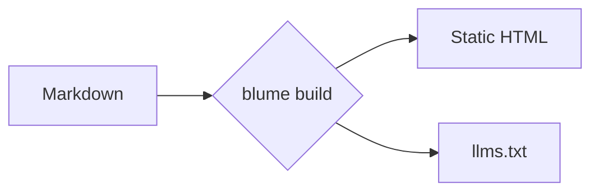
````

डायग्राम क्लाइंट पर रेंडर होते हैं, इसलिए यह केवल-MDX फ़ीचर है, और Mermaid लाइब्रेरी केवल उन्हीं पेजों पर लोड होती है जिनमें कोई डायग्राम हो। इस अनुभाग का बाकी हिस्सा सामान्य प्रकारों की एक गैलरी है — पूरी सूची के लिए [Mermaid डॉक्स](https://mermaid.js.org/intro/) देखें।

### फ़्लोचार्ट


### सीक्वेंस डायग्राम

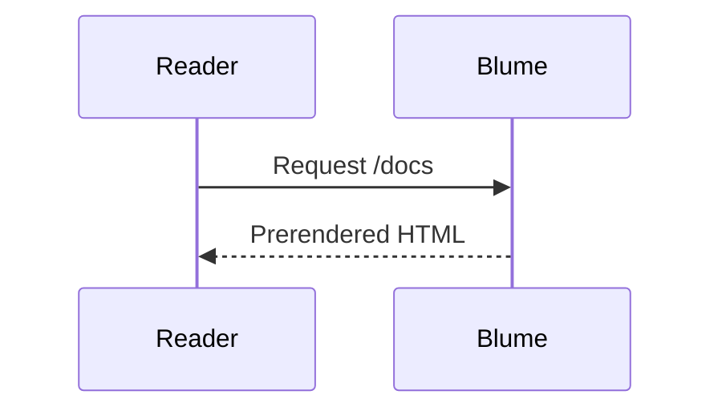

### क्लास डायग्राम

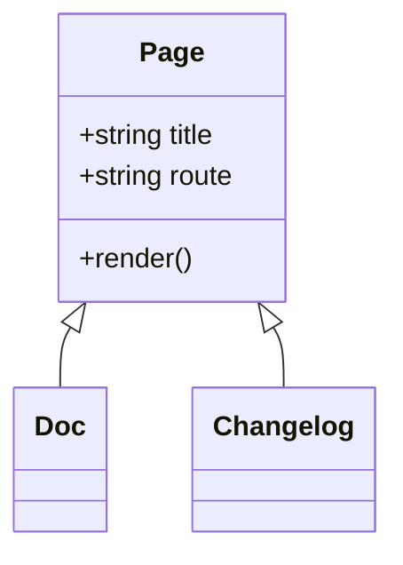

### स्टेट डायग्राम

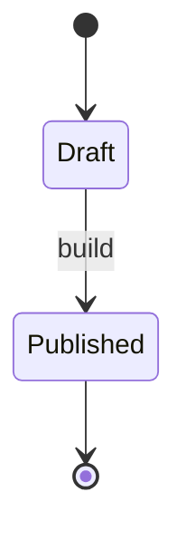

### एंटिटी रिलेशनशिप

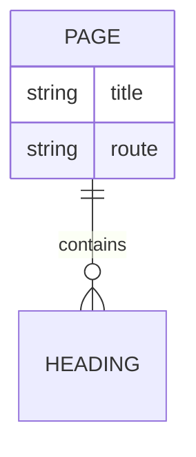

### यूज़र जर्नी

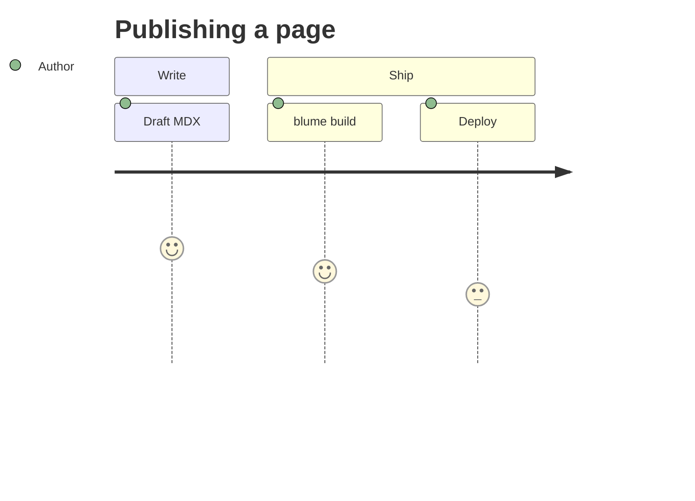

### गैंट

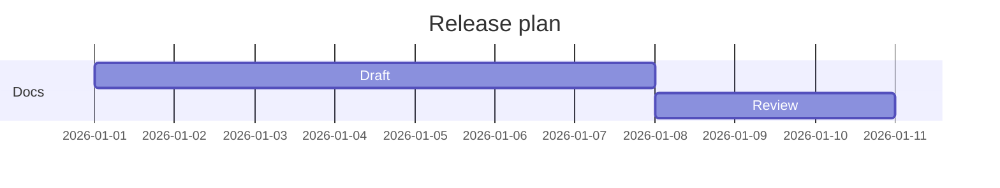

### गिट ग्राफ़

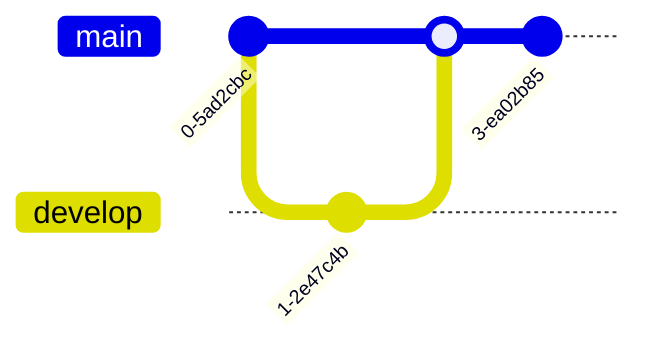

### पाई चार्ट

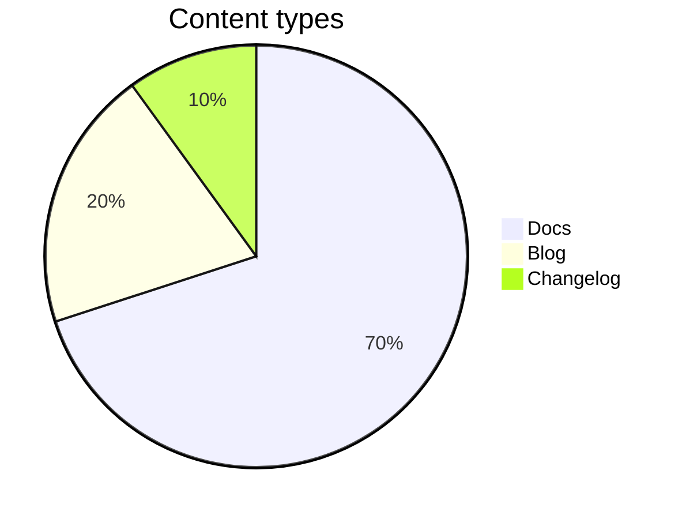

### माइंडमैप

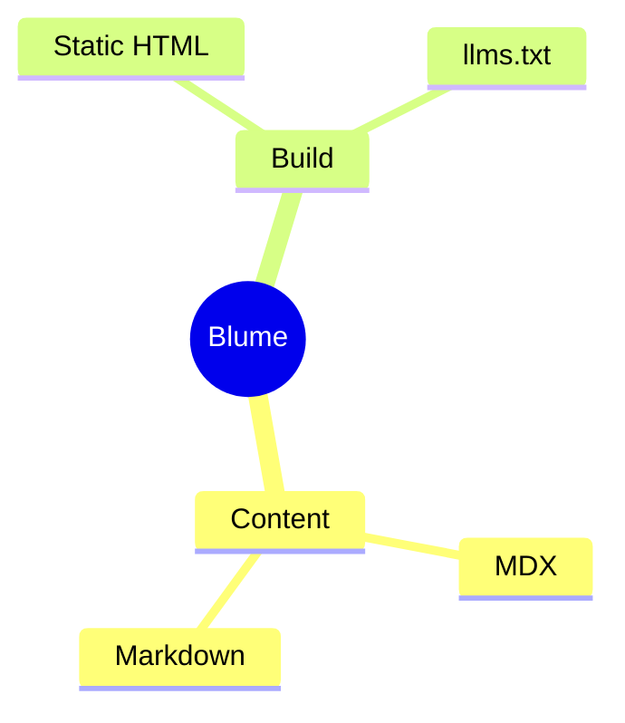

### टाइमलाइन

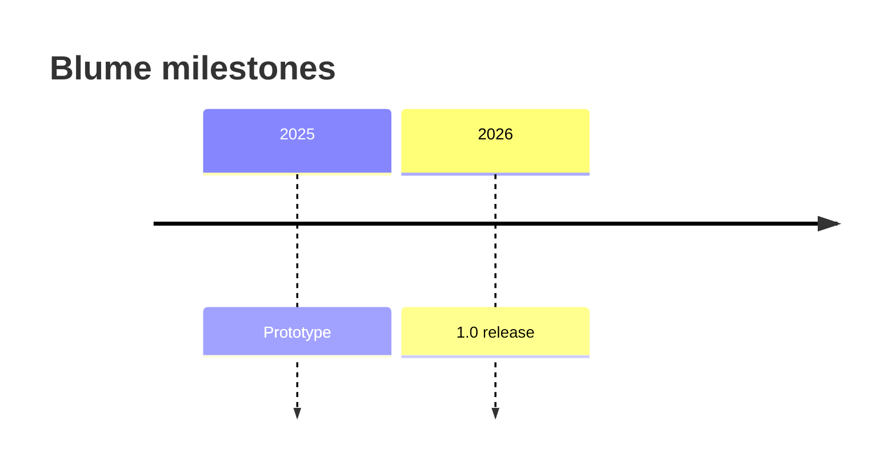

## कॉलआउट

कॉलआउट पाठक का ध्यान संदर्भ, सलाह, या जोखिम की ओर खींचते हैं। उन्हें `:::type` डायरेक्टिव के रूप में लिखें; ब्रैकेट में शीर्षक जोड़ें, जैसे `:::warning[Heads up]`। डायरेक्टिव केवल-MDX फ़ीचर हैं — किसी `.md` फ़ाइल में `:::note` लाइन शाब्दिक पाठ ही रहती है।

### नोट

तटस्थ, सहायक संदर्भ जिसे पाठक को ध्यान में रखना चाहिए।

:::note
Blume हर रन पर `.blume/` को फिर से बनाता है — इसे कभी हाथ से संपादित न करें।
:::

```md
:::note
Blume regenerates `.blume/` on every run — never edit it by hand.
:::
```

### टिप

एक उपयोगी शॉर्टकट या सर्वोत्तम अभ्यास जो अनिवार्य नहीं है पर जीवन आसान बना देता है।

:::tip
`deployment.site` सेट करें ताकि साइटमैप और Open Graph इमेज निरपेक्ष URL का उपयोग करें।
:::

```md
:::tip
Set `deployment.site` so sitemaps and Open Graph images use absolute URLs.
:::
```

### सफलता

किसी सकारात्मक परिणाम की पुष्टि करें या यह कि कोई चरण अपेक्षा के अनुसार पूरा हुआ।

:::success
आपके डॉक्स सफलतापूर्वक बन गए और डिप्लॉय के लिए तैयार हैं।
:::

```md
:::success
Your docs built successfully and are ready to deploy.
:::
```

### चेतावनी

ऐसी किसी बात को चिह्नित करें जिसमें गलती या अप्रत्याशित व्यवहार से बचने के लिए सावधानी चाहिए।

:::warning[ध्यान दें]
`output: "server"` पर स्विच करने के लिए डिप्लॉय करने से पहले एक एडाप्टर चाहिए।
:::

```md
:::warning[Heads up]
Switching to `output: "server"` requires an adapter before you can deploy.
:::
```

### ख़तरा

ऐसी विध्वंसक या भंजक कार्रवाई को उजागर करें जिसे आसानी से पलटा नहीं जा सकता।

:::danger
`blume eject` एकतरफ़ा कदम है — उत्पन्न Astro प्रोजेक्ट आपका हो जाता है।
:::

```md
:::danger
`blume eject` is a one-way step — the generated Astro project becomes yours.
:::
```

### जानकारी

एक सूचनात्मक टिप्पणी; एक उपनाम-अनुकूल डिफ़ॉल्ट जो तटस्थ लगता है।

:::info
कोर थीम कोई क्लाइंट फ़्रेमवर्क JS शिप नहीं करती।
:::

```md
:::info
The core theme ships no client framework JS.
:::
```

`caution`, `error`, `important`, और `warn` नाम क्रमशः `warning`, `danger`, `note`, और `warning` के उपनाम के रूप में स्वीकार किए जाते हैं।

## गणित

KaTeX के साथ LaTeX को केंद्रित ब्लॉक के रूप में रेंडर करें — गणित-प्रधान या वैज्ञानिक डॉक्स के लिए उपयोगी। किसी सूत्र को `$$…$$` में लपेटें:

$$
\int_0^\infty e^{-x^2}\,dx = \frac{\sqrt{\pi}}{2}
$$

```md
$$
a^2 + b^2 = c^2
$$
```

:::note
गणित केवल ब्लॉक-स्तर पर है और स्वतः चालू है — `$$…$$` लिखें और यह रेंडर हो जाता है; न लिखें तो KaTeX की स्टाइलशीट कभी शिप नहीं होती। इनलाइन `$…$` गणित नहीं है: अकेला `$` (मुद्रा, शेल वेरिएबल, कोड) हमेशा शाब्दिक पाठ ही रहता है, इसलिए न कोई डीलिमिटर एस्केप करना है और न कोई सेटिंग टॉगल करनी है। गणित एक केवल-MDX फ़ीचर है।
:::

## स्मार्ट विराम-चिह्न

Blume लिखते समय सीधे उद्धरण चिह्नों और डैश को टाइपोग्राफिक समकक्षों में बदल देता है, ताकि गद्य ऐसा पढ़ा जाए जैसे उसे टाइपसेट किया गया हो — किसी विशेष वर्ण की ज़रूरत नहीं।

"उद्धरण" घुमावदार हो जाते हैं, -- एन डैश बन जाता है, --- एम डैश, और ... एक दीर्घवृत्त।

```md
"Quotes" become curly, -- becomes an en dash, --- an em dash, and ... an ellipsis.
```
