Blume は、標準的な Markdown と MDX を、厳選された GitHub Flavored の機能セットでレンダリングします — インポートも設定も不要です。これまでどおりの書き方でコンテンツを書いてください。このページでは、サポートされているすべての機能を、ライブプレビューと各ソースとともに紹介します。

## 見出し

見出しでページを構造化します。Blume はフロントマターの `title` をページ見出しとしてレンダリングするため、コンテンツは `##` から始めてください — `##` と `###` は目次の項目になります。`##`〜`######` のすべての見出しは、それ自身のアンカーへのリンクでも囲まれるため、読者は見出しをクリックしてそのセクションへのパーマリンクをコピー、ブックマーク、共有できます（ホバーすると `#` が表示されます）。これをオフにするには、`blume.config.ts` で `markdown: { headingAnchors: false }` を指定します。

```md
## Section

### Subsection

#### Detail
```

## 強調

単語を強調したり、削除を示したり、文中でコードやキー入力を表示したりするためのインライン書式です。

**太字**、_斜体_、~~取り消し線~~、そして `インラインコード`。

```md
**Bold**, _italic_, ~~strikethrough~~, and `inline code`.
```

## 上付き文字と下付き文字

脚注記号、序数、そして科学表記や化学表記をインラインで表現するために使います。

E = mc^2^ と H~2~O。

{/* prettier-ignore */}
```md
E = mc^2^ and H~2~O.
```

## 引用

引用、補足のコールアウト、編集上の注記を周囲の本文から切り離します。

> 高速で、AI に対応し、設定不要のドキュメント — テンプレートに至るまで。

```md
> Documentation that's fast, AI-ready, and zero-config — down to the template.
```

## リスト

順序のない集合には箇条書きリスト、順序のある手順には番号付きリスト、チェックリストやロードマップにはタスクリストを使います。

- Markdown ファーストの執筆
- デフォルトで静的
  - サーバー機能はオプトイン
- 出力は自分のもの

1. Blume をインストールする
2. ページを書く
3. 公開する

- [x] プロジェクトの雛形を作成
- [ ] 最初のガイドを書く

```md
- Markdown-first authoring
- Static by default
  - Opt into server features
- Own your output

1. Install Blume
2. Write a page
3. Ship it

- [x] Scaffold the project
- [ ] Write the first guide
```

## テーブル

設定オプション、比較表、パラメータ一覧といった構造化データを表にします。区切り行にコロンを使うと、列を揃えられます。

| コマンド      | 説明                   |  出力   |
| ------------- | ---------------------- | :-----: |
| `blume dev`   | 開発サーバーを起動する |    —    |
| `blume build` | 静的サイトをビルドする | `dist/` |

```md
| Command       | Description           | Output  |
| ------------- | --------------------- | :-----: |
| `blume dev`   | Start the dev server  |    —    |
| `blume build` | Build the static site | `dist/` |
```

ヘッダー行のないテーブル — 例えばキーと値の組 — が必要な場合は、ヘッダーのセルを空のままにします。Markdown は構文上ヘッダー行と区切り行を必要としますが、Blume はレンダリングされたテーブルから空のヘッダーを取り除きます。

```md
|                |          |
| -------------- | -------- |
| Current status | E-3 visa |
```

## リンクと画像

他のページや外部サイトにリンクします。画像には、コンテンツの隣にあるファイルへの相対パス、`public/` 以下の任意のパス（サイトルートで配信されます）、またはリモート URL を指定できます。

まずは[クイックスタート](/docs/quickstart)をお読みください。

```md
Read the [quickstart](/docs/quickstart) to get started.


```

**ローカル画像には相対パスを推奨します** — ビルド時に最適化されるためです：圧縮され、WebP に変換され、固有の `width`/`height` が付与されるので、読み込み中にページがずれません。画像はそれを使うページの隣（またはコンテンツディレクトリ内の共有フォルダ）に置き、相対パスで参照してください：

```md

```

`public/` 以下の絶対パス（``）は最適化なしでそのまま配信されます — ドキュメントの外から参照されるロゴのように、バイト列と URL を厳密に保つ必要があるファイルに使ってください。リモート画像も、そのホストが [`image` 設定](/docs/configuration#images)で許可されていない限り、手を加えずにそのまま渡されます。

コンテンツ内の画像はデフォルトでクリックしてズームできます — 読者は任意の画像をクリックしてライトボックスで開けます。これをオフにするには `blume.config.ts` で `markdown: { imageZoom: false }` を指定するか、`data-no-zoom` で個別の画像だけ除外します。

## 水平線

長いページの中で、話題が大きく切り替わる箇所を区切ります。

---

```md
---
```

## コードブロック

フェンス付きコードブロックは構文ハイライトされ、言語を示すヘッダー（認識された言語にはブランドアイコン付き）とコピーボタンが表示されます。言語の後に**タイトル** — 通常はファイル名 — を追加すると、ヘッダーの言語ラベルの代わりに表示されます。

```ts blume.config.ts
import { defineConfig } from "blume";

export default defineConfig({
  title: "My docs",
});
```

````md
```ts blume.config.ts
import { defineConfig } from "blume";

export default defineConfig({
  title: "My docs",
});
```
````

インラインコードもハイライトできます：バッククォートで囲んだ範囲の中に `{:lang}` マーカーを追加すると、小さなコードブロックのように色付けされます — `useState(){:js}` や `T extends object{:ts}` のように。マーカーを追加したときだけ有効になるので、通常のインラインコードはそのままです — 何かを有効にする必要はありません。

ハイライトはデフォルトで `github-light`/`github-dark` テーマを使います。`markdown.codeBlocks.theme` を使えば、カラーモードごとに任意の[同梱 Shiki テーマ](https://shiki.style/themes)に差し替えられます — すべてのコード表示（フェンス、インラインスニペット、`<CodeBlock>`、`<Diff>`）が一度に色付けされます：

```ts blume.config.ts
export default defineConfig({
  markdown: {
    codeBlocks: {
      theme: { light: "github-light", dark: "vesper" },
    },
  },
});
```

カスタムの [Shiki テーマ定義](https://shiki.style/guide/load-theme)を直接指定することもできます。VS Code 互換のテーマ JSON ファイルをインポートし（ランタイムが必要とする場合はインポート属性を使います）、いずれかのカラーモードに割り当ててください。同梱テーマ名とカスタム定義を混在させることもできます：

```ts blume.config.ts
import darkTheme from "./themes/acme-dark.json" with { type: "json" };

export default defineConfig({
  markdown: {
    codeBlocks: {
      theme: { light: "github-light", dark: darkTheme },
    },
  },
});
```

### 行番号

`lineNumbers` を付けると行番号の余白がレンダリングされます — 単独でも、タイトルと併用しても使えます：

```ts server.ts lineNumbers
import { serve } from "blume";

serve({ port: 3000 });
```

````md
```ts server.ts lineNumbers
import { serve } from "blume";

serve({ port: 3000 });
```
````

### ハイライト

GitHub 形式のコメントでコードに注釈を付け、行・単語・変更点に注目を集めます。コメントはレンダリング結果から取り除かれるので、コードはコピー＆ペーストしてもきれいなままです。4 種類すべてデフォルトで有効です — 設定は不要です。

`// [!code highlight]` で行に印を付けると、その行の背景がハイライトされます：

```ts
const config = defineConfig({
  title: "My docs", // [!code highlight]
});
```

追加は `// [!code ++]`、削除は `// [!code --]` で変更を示すと、緑／赤の差分としてレンダリングされます：

```ts
export default defineConfig({
  title: "My docs", // [!code --]
  title: "Blume docs", // [!code ++]
});
```

`// [!code word:serve]` で、行内のある語のすべての出現箇所をハイライトします：

```ts
import { serve } from "blume"; // [!code word:serve]

serve({ port: 3000 });
```

`// [!code focus]` で印を付けた行以外をすべて暗くします（残りはホバーすると鮮明になります）：

```ts
export default defineConfig({
  title: "My docs", // [!code focus]
  description: "Built with Blume",
});
```

または、コメントの代わりに**行番号**で行をハイライトすることもできます — コードを編集できない場合に便利です。言語の後に波括弧で範囲を書きます。単一行、カンマ区切りのリスト、`start-end` の範囲がすべて使えます：

```ts {1,4-5}
import { defineConfig } from "blume";

export default defineConfig({
  title: "My docs",
  description: "Built with Blume",
});
```

````md
```ts {1,4-5}
import { defineConfig } from "blume";

export default defineConfig({
  title: "My docs",
  description: "Built with Blume",
});
```
````

### 表示タイプ

TypeScript のブロックに `twoslash` を付けると、コンパイラから直接得られた実際の型が表示されます — [Twoslash](https://shiki.style/packages/twoslash) によるものです。任意のトークンにホバーすると推論された型が表示され、インラインの `^?` クエリを追加すると、その行の下に型を固定表示できます。

```ts twoslash
const config = {
  title: "My docs",
  version: 1,
};

config.title;
//     ^?
```

````md
```ts twoslash
const config = { title: "My docs", version: 1 };

config.title;
//     ^?
```
````

:::note
言語アイコンを非表示にしたり、長い行をスクロールさせる代わりに折り返したりするには、`blume.config.ts` で `markdown: { code: { icons: false, wrap: true } }` を指定します。
:::

## パッケージインストール

`package-install` ブロックは、1 つのインストールコマンドを npm、pnpm、yarn、bun のタブ付きスニペットに変換します — 読者は自分の環境に合ったものをコピーできます。図表や数式と同様に、これは MDX 専用の機能です — `.md` ファイルではこのブロックは通常のコードフェンスとしてレンダリングされます。

```package-install
npm i blume
```

````md
```package-install
npm i blume
```
````

## 図表

`mermaid` ブロックは、テキストから直接 [Mermaid](https://mermaid.js.org) の図をレンダリングします。フェンスの内容はそのまま Mermaid に渡されるため、Mermaid がサポートするあらゆる図の種類がここで使えます。図はアクティブなカラーテーマに従い、テーマが変わると再レンダリングされます。ソースを `mermaid` でフェンスして記述します：

````md
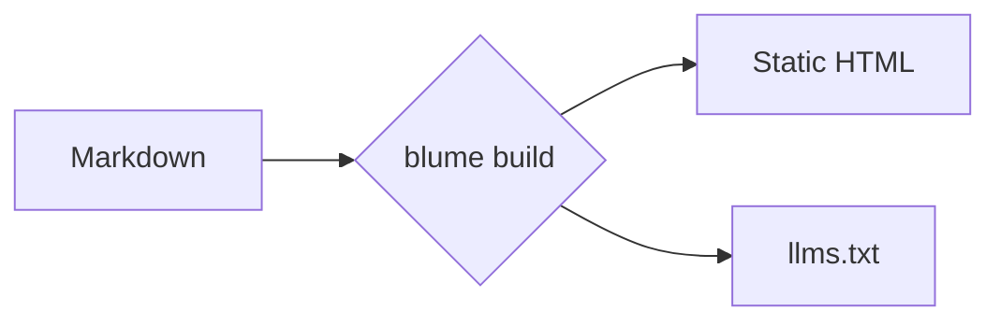
````

図はクライアント側でレンダリングされるため、これは MDX 専用の機能であり、Mermaid ライブラリは図を含むページでのみ読み込まれます。このセクションの残りは代表的な種類のギャラリーです — 全一覧は [Mermaid のドキュメント](https://mermaid.js.org/intro/)を参照してください。

### フローチャート


### シーケンス図

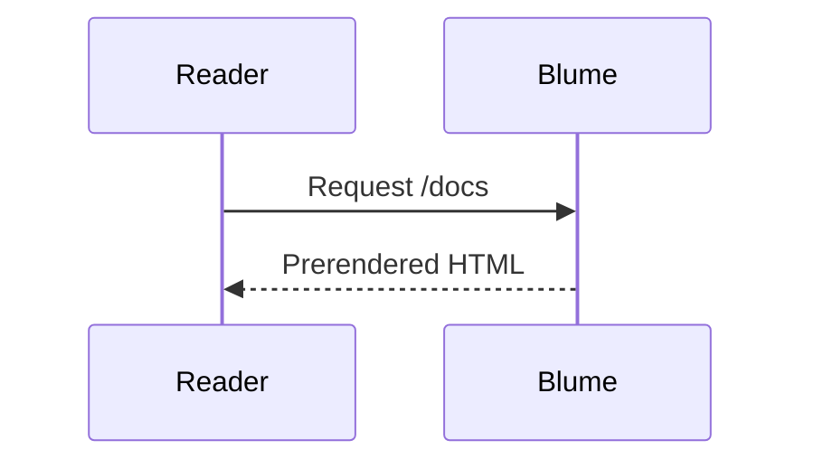

### クラス図

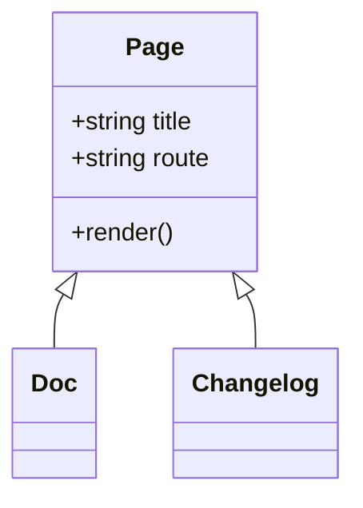

### 状態遷移図

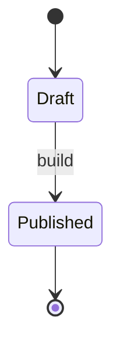

### ER 図

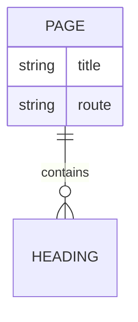

### ユーザージャーニー

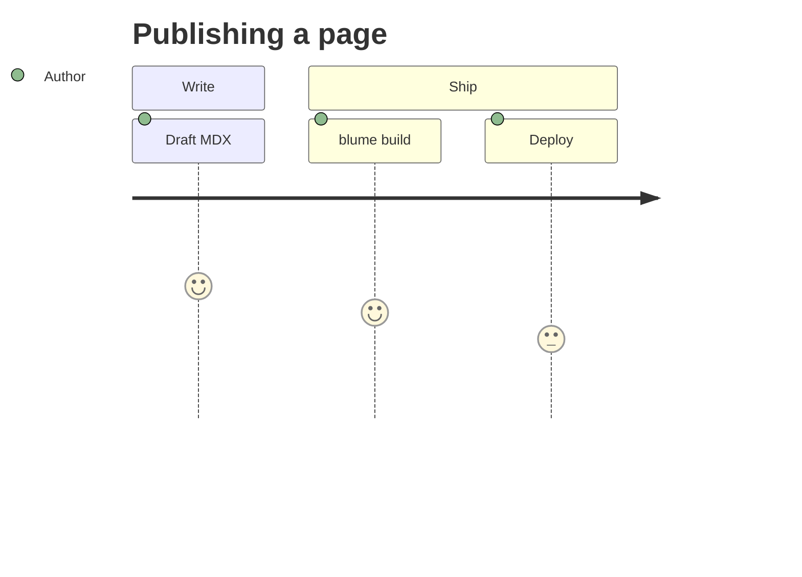

### ガントチャート

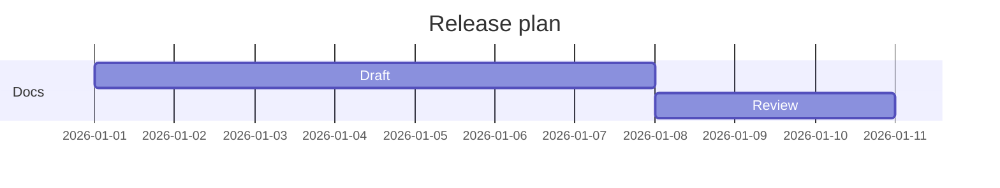

### Git グラフ

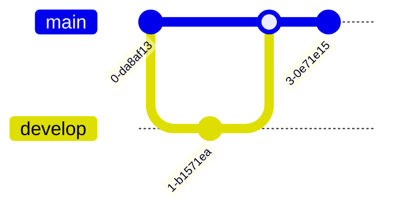

### 円グラフ

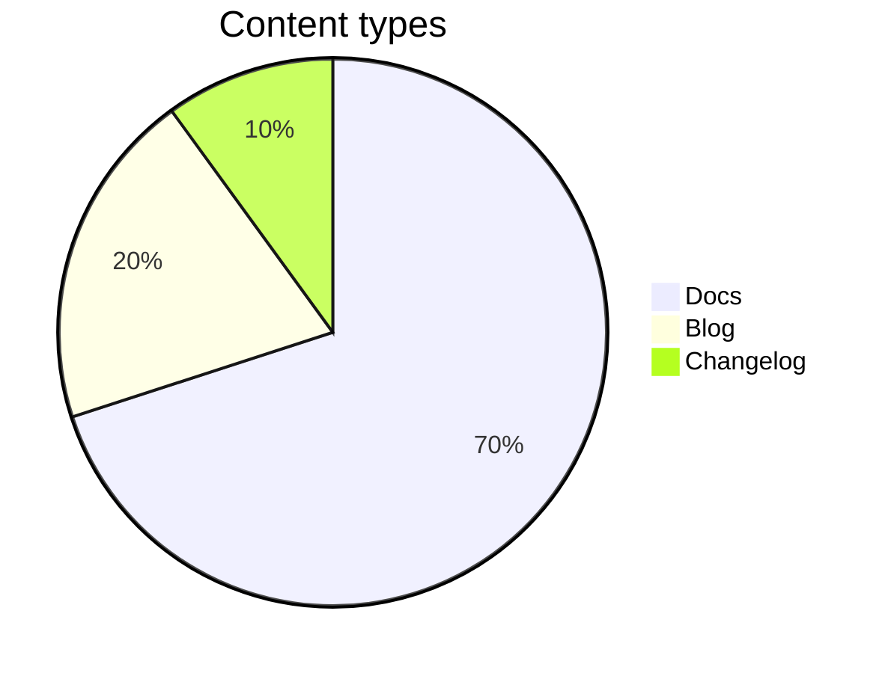

### マインドマップ

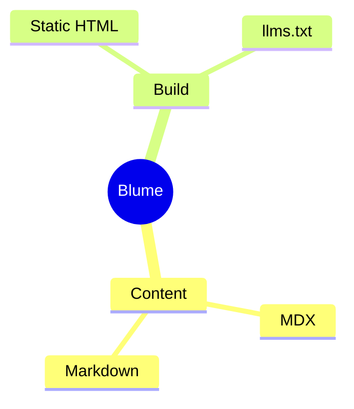

### タイムライン

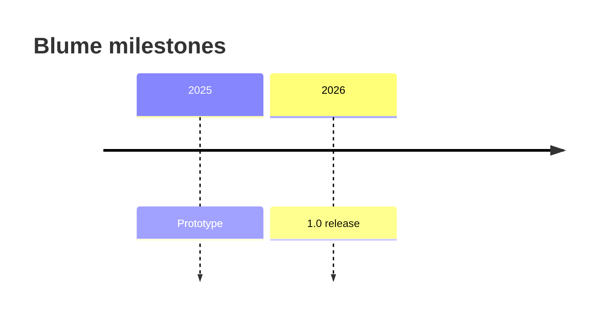

## コールアウト

コールアウトは、背景情報・助言・リスクに読者の注意を向けます。`:::type` ディレクティブとして書き、`:::warning[Heads up]` のように角括弧でタイトルを追加できます。ディレクティブは MDX 専用の機能です — `.md` ファイルでは `:::note` の行はそのまま文字列として残ります。

### Note

読者が心に留めておくべき、中立的な補足情報です。

:::note
Blume は実行のたびに `.blume/` を再生成します — 手動で編集しないでください。
:::

```md
:::note
Blume regenerates `.blume/` on every run — never edit it by hand.
:::
```

### Tip

必須ではないものの、作業を楽にしてくれる便利な近道やベストプラクティスです。

:::tip
`deployment.site` を設定すると、サイトマップと Open Graph 画像が絶対 URL を使うようになります。
:::

```md
:::tip
Set `deployment.site` so sitemaps and Open Graph images use absolute URLs.
:::
```

### Success

良好な結果や、手順が期待どおりに完了したことを伝えます。

:::success
ドキュメントのビルドに成功し、デプロイの準備が整いました。
:::

```md
:::success
Your docs built successfully and are ready to deploy.
:::
```

### Warning

ミスや予想外の挙動を避けるために注意が必要な点を示します。

:::warning[ご注意]
`output: "server"` に切り替える場合、デプロイの前にアダプターが必要です。
:::

```md
:::warning[Heads up]
Switching to `output: "server"` requires an adapter before you can deploy.
:::
```

### Danger

簡単には元に戻せない、破壊的または破壊的変更を伴う操作を警告します。

:::danger
`blume eject` は一方通行の手順です — 生成された Astro プロジェクトはあなたのものになります。
:::

```md
:::danger
`blume eject` is a one-way step — the generated Astro project becomes yours.
:::
```

### Info

情報提供のための補足です。中立的に読める、エイリアスにも使いやすいデフォルトです。

:::info
コアテーマにはクライアントフレームワークの JS は含まれません。
:::

```md
:::info
The core theme ships no client framework JS.
:::
```

`caution`、`error`、`important`、`warn` という名前は、それぞれ `warning`、`danger`、`note`、`warning` のエイリアスとして使えます。

## 数式

KaTeX で LaTeX を中央揃えのブロックとしてレンダリングします — 数式の多いドキュメントや科学系のドキュメントに便利です。数式を `$$…$$` で囲みます：

$$
\int_0^\infty e^{-x^2}\,dx = \frac{\sqrt{\pi}}{2}
$$

```md
$$
a^2 + b^2 = c^2
$$
```

:::note
数式はブロック専用で、自動的に有効になります — `$$…$$` と書けばレンダリングされ、書かなければ KaTeX のスタイルシートは一切配信されません。インラインの `$…$` 数式はありません：単独の `$`（通貨、シェル変数、コード）は常にそのままの文字列として扱われるため、エスケープすべき区切り文字も、切り替える設定もありません。数式は MDX 専用の機能です。
:::

## スマート句読点

Blume は、書いているそばから直線的な引用符やダッシュを組版上の等価な記号に変換するため、特殊文字を使わなくても、組版されたかのように文章が読めます。

"Quotes" は曲線的な引用符になり、-- は en ダッシュ、--- は em ダッシュ、... は省略記号になります。

```md
"Quotes" become curly, -- becomes an en dash, --- an em dash, and ... an ellipsis.
```
