O Blume renderiza Markdown e MDX padrão com um conjunto de recursos curado, no estilo GitHub — sem imports, sem configuração. Escreva conteúdo do jeito que você já escreve; esta página mostra tudo o que é suportado, com uma pré-visualização ao vivo e o código-fonte de cada recurso.

## Títulos

Estruture uma página com títulos. O Blume renderiza o `title` do frontmatter como o título da página, então comece seu conteúdo em `##` — `##` e `###` viram entradas no índice. Todo título de `##` a `######` também é envolvido em um link para sua própria âncora, para que os leitores possam clicar em um título para copiar, salvar nos favoritos ou compartilhar um link permanente direto para aquela seção (passe o cursor para revelar o `#`). Desative isso com `markdown: { headingAnchors: false }` no `blume.config.ts`.

```md
## Section

### Subsection

#### Detail
```

### Âncoras personalizadas

Os ids das âncoras são gerados a partir do texto do título, então um título reescrito ganha uma âncora nova. Acrescente `[#custom-id]` para fixar a âncora — o marcador nunca é renderizado, e os links continuam funcionando independentemente de como o título estiver escrito. Âncoras fixadas também permanecem idênticas entre [locales traduzidos](/docs/content/i18n), onde ids gerados automaticamente seriam diferentes em cada idioma.

```md
## Getting started [#setup]
```

Crie um link para ela como `/page#setup`. A sintaxe é igual à do Fumadocs, então conteúdo migrado funciona sem alterações.

A forma `{#custom-id}`, usada pelo Pandoc, pelo kramdown e por toolchains de especificação baseadas em Markdown, é aceita como equivalente em arquivos `.md`. No `.mdx`, um `{…}` solto é uma expressão JSX e a página não compila — o `blume check` reporta o marcador como `BLUME_MDX_CURLY_ANCHOR` — então escreva `[#custom-id]` ali, ou escape as chaves. A forma escapada fixa a mesma âncora nos dois formatos, o que a torna a grafia certa para um partial que páginas `.mdx` [incluem](/docs/content/includes):

```md
## Getting started \{#setup\}
```

Links de fragmento também podem apontar para um elemento HTML puro com um `id` (`<a id="setup"></a>`); o `blume validate` aceita esses casos junto com as âncoras de título.

### Marcadores do índice

Outros dois marcadores finais controlam como um título aparece no índice. `[!toc]` mantém o título na página, mas fora do índice; `[toc]` faz o contrário — o título aparece apenas no índice, como um alvo de âncora invisível, o que é útil para rotular seções construídas com componentes em vez de prosa. Os marcadores podem ser encadeados em qualquer ordem. Uma exceção, herdada do CommonMark: um colchete final cujo rótulo tenha uma definição de referência de link em qualquer lugar da página (`[toc]: /url`) é um link de referência abreviado, não um marcador, e permanece no texto do título.

```md
## Appears on the page only [!toc]

## Appears in the TOC only [toc]

## Both markers together [toc] [#custom-id]
```

Os marcadores são sempre interpretados — um título que termine literalmente com um texto no formato de marcador seria tratado como marcado. Escapar com barra invertida não ajuda (o Markdown resolve `\[` para `[` antes de a análise do marcador rodar); para exibir o texto literal de um marcador no fim de um título, coloque-o em código inline: `` ## Using `[toc]` ``.

## Ênfase

Formatação inline para enfatizar palavras, marcar exclusões e mostrar código ou teclas no meio da frase.

**Negrito**, _itálico_, ~~tachado~~ e `código inline`.

```md
**Bold**, _italic_, ~~strikethrough~~, and `inline code`.
```

## Sobrescrito e subscrito

Para marcadores de nota de rodapé, ordinais e notação científica ou química inline.

E = mc^2^ e H~2~O.

{/* prettier-ignore */}
```md
E = mc^2^ and H~2~O.
```

## Citações

Destaque uma citação, um aparte de atenção ou uma nota editorial do texto ao redor.

> Documentação rápida, pronta para IA e sem configuração — até o template.

```md
> Documentation that's fast, AI-ready, and zero-config — down to the template.
```

## Listas

Use listas não ordenadas para conjuntos sem ordem, listas ordenadas para sequências e listas de tarefas para checklists e roadmaps.

- Autoria orientada a Markdown
- Estático por padrão
  - Adote recursos de servidor quando quiser
- Seja dono da sua saída

1. Instale o Blume
2. Escreva uma página
3. Publique

- [x] Estruturar o projeto
- [ ] Escrever o primeiro guia

```md
- Markdown-first authoring
- Static by default
  - Opt into server features
- Own your output

1. Install Blume
2. Write a page
3. Ship it

- [x] Scaffold the project
- [ ] Write the first guide
```

## Tabelas

Tabule dados estruturados — opções de configuração, matrizes de comparação, listas de parâmetros. Use dois-pontos na linha divisória para alinhar colunas.

| Comando       | Descrição                |  Saída  |
| ------------- | ------------------------ | :-----: |
| `blume dev`   | Inicia o servidor de dev |    —    |
| `blume build` | Compila o site estático  | `dist/` |

```md
| Command       | Description           | Output  |
| ------------- | --------------------- | :-----: |
| `blume dev`   | Start the dev server  |    —    |
| `blume build` | Build the static site | `dist/` |
```

Para uma tabela sem linha de cabeçalho — pares chave–valor, por exemplo — deixe as células do cabeçalho vazias. O Markdown exige as linhas de cabeçalho e divisória sintaticamente, mas o Blume remove o cabeçalho vazio da tabela renderizada.

```md
|                |          |
| -------------- | -------- |
| Current status | E-3 visa |
```

## Links e imagens

Crie links para outras páginas ou sites externos. As imagens aceitam um caminho relativo para um arquivo ao lado do seu conteúdo, qualquer caminho dentro de `public/` (servido na raiz do site) ou uma URL remota.

Leia o [guia rápido](/docs/quickstart) para começar.

```md
Read the [quickstart](/docs/quickstart) to get started.


```

**Prefira caminhos relativos para imagens locais** — elas são otimizadas em tempo de build: comprimidas, convertidas para WebP e marcadas com `width`/`height` intrínsecos para que a página não salte durante o carregamento. Mantenha a imagem ao lado da página que a usa (ou em uma pasta compartilhada dentro do seu diretório de conteúdo) e a referencie de forma relativa:

```md

```

Caminhos absolutos dentro de `public/` (``) são servidos literalmente, sem otimização — use-os para arquivos que precisam manter exatamente seus bytes e URL, como um logotipo referenciado de fora da sua documentação. Imagens remotas também são repassadas intocadas, a menos que seu host esteja autorizado na [configuração de `image`](/docs/configuration#images).

As imagens de conteúdo têm zoom por clique por padrão — os leitores podem clicar em qualquer imagem para abri-la em um lightbox. Desative isso com `markdown: { imageZoom: false }` no `blume.config.ts`, ou exclua uma única imagem com `data-no-zoom`.

## Linha horizontal

Separe grandes mudanças de assunto dentro de uma página longa.

---

```md
---
```

## Blocos de código

Blocos de código delimitados por cercas recebem realce de sintaxe com um cabeçalho mostrando a linguagem — com um ícone da marca para linguagens reconhecidas — e um botão de copiar. Adicione um **título** depois da linguagem — normalmente um nome de arquivo — e ele substitui o rótulo da linguagem no cabeçalho.

```ts blume.config.ts
import { defineConfig } from "blume";

export default defineConfig({
  title: "My docs",
});
```

````md
```ts blume.config.ts
import { defineConfig } from "blume";

export default defineConfig({
  title: "My docs",
});
```
````

O código inline também pode receber realce: adicione um marcador `{:lang}` dentro de um trecho entre crases e ele é colorido como um pequeno bloco de código — `useState(){:js}` ou `T extends object{:ts}`. Isso só entra em ação quando você adiciona o marcador, então o código inline comum permanece intocado — nada para ativar.

O realce usa os temas `github-light`/`github-dark` por padrão. Troque por qualquer [tema Shiki incluído](https://shiki.style/themes) por modo de cor com `markdown.codeBlocks.theme` — ele colore todas as superfícies de código de uma vez (cercas, trechos inline, `<CodeBlock>` e `<Diff>`):

```ts blume.config.ts
export default defineConfig({
  markdown: {
    codeBlocks: {
      theme: { light: "github-light", dark: "vesper" },
    },
  },
});
```

Você também pode fornecer uma [definição de tema Shiki](https://shiki.style/guide/load-theme) personalizada diretamente. Importe um arquivo JSON de tema compatível com o VS Code (usando um atributo de import quando seu runtime exigir) e atribua-o a qualquer modo de cor; nomes incluídos e definições personalizadas podem ser combinados:

```ts blume.config.ts
import darkTheme from "./themes/acme-dark.json" with { type: "json" };

export default defineConfig({
  markdown: {
    codeBlocks: {
      theme: { light: "github-light", dark: darkTheme },
    },
  },
});
```

### Números de linha

Acrescente `lineNumbers` para renderizar uma coluna com números de linha — sozinho ou junto de um título:

```ts server.ts lineNumbers
import { serve } from "blume";

serve({ port: 3000 });
```

````md
```ts server.ts lineNumbers
import { serve } from "blume";

serve({ port: 3000 });
```
````

### Realce

Anote o código com comentários no estilo GitHub para chamar atenção para linhas, palavras e alterações. Os comentários são removidos da saída renderizada, então o código continua limpo para copiar e colar. Todos os quatro estão ativos por padrão — sem configuração.

Marque uma linha com `// [!code highlight]` para dar a ela um fundo realçado:

```ts
const config = defineConfig({
  title: "My docs", // [!code highlight]
});
```

Mostre alterações com `// [!code ++]` para adições e `// [!code --]` para remoções, renderizadas como um diff verde/vermelho:

```ts
export default defineConfig({
  title: "My docs", // [!code --]
  title: "Blume docs", // [!code ++]
});
```

Realce todas as ocorrências de um termo em uma linha com `// [!code word:serve]`:

```ts
import { serve } from "blume"; // [!code word:serve]

serve({ port: 3000 });
```

Escureça tudo, exceto as linhas que você marcar com `// [!code focus]` (o restante fica nítido ao passar o cursor):

```ts
export default defineConfig({
  title: "My docs", // [!code focus]
  description: "Built with Blume",
});
```

Ou realce linhas por **número** em vez de comentários — útil quando você não pode editar o código. Coloque um intervalo entre chaves depois da linguagem; linhas isoladas, listas separadas por vírgula e intervalos `início-fim` funcionam:

```ts {1,4-5}
import { defineConfig } from "blume";

export default defineConfig({
  title: "My docs",
  description: "Built with Blume",
});
```

````md
```ts {1,4-5}
import { defineConfig } from "blume";

export default defineConfig({
  title: "My docs",
  description: "Built with Blume",
});
```
````

### Tipos exibidos

Marque um bloco TypeScript com `twoslash` para exibir tipos reais direto do compilador — com tecnologia do [Twoslash](https://shiki.style/packages/twoslash). Passe o cursor sobre qualquer token para ver seu tipo inferido e adicione uma consulta inline `^?` para fixar um tipo abaixo da linha.

```ts twoslash
const config = {
  title: "My docs",
  version: 1,
};

config.title;
//     ^?
```

````md
```ts twoslash
const config = { title: "My docs", version: 1 };

config.title;
//     ^?
```
````

### Abas de TypeScript e JavaScript

Marque um bloco `ts` ou `tsx` com `ts2js` para renderizá-lo como um par de abas: seu TypeScript ao lado de uma variante JavaScript gerada automaticamente, para que você mantenha um único trecho e os leitores escolham seu dialeto. A conversão remove a sintaxe de tipos e os imports somente de tipos, mantendo sua formatação, seus comentários e o JSX exatamente como você escreveu — e as abas são sincronizadas, então escolher JavaScript uma vez troca todos os pares da página. Como os diagramas e a matemática, este é um recurso exclusivo do MDX — em um arquivo `.md` o bloco é renderizado como uma cerca de código TypeScript comum.

```ts ts2js
import { defineConfig } from "blume";

interface Author {
  name: string;
}

const author: Author = { name: "Hayden" };

export default defineConfig({
  title: `${author.name}'s docs`,
});
```

````md
```ts ts2js
import { defineConfig } from "blume";

interface Author {
  name: string;
}

const author: Author = { name: "Hayden" };

export default defineConfig({
  title: `${author.name}'s docs`,
});
```
````

Outros metadados da cerca se combinam: um `title="..."` aparece nas duas abas, enquanto intervalos de linha `{1,4-5}` se aplicam apenas à aba TypeScript (os números das linhas mudam quando os tipos somem). A única exceção é `twoslash` — os tipos exibidos ao passar o cursor não podem ser transferidos para o código gerado, então uma cerca marcada com os dois continua sendo um bloco Twoslash comum.

:::note
Oculte os ícones de linguagem ou quebre linhas longas em vez de rolar com `markdown: { code: { icons: false, wrap: true } }` no `blume.config.ts`.
:::

## Instalação de pacotes

Um bloco `package-install` transforma um único comando de instalação em um trecho com abas para npm, pnpm, yarn e bun — assim os leitores copiam o que corresponde à sua configuração. Como os diagramas e a matemática, este é um recurso exclusivo do MDX — em um arquivo `.md` o bloco é renderizado como uma cerca de código comum.

```package-install
npm i blume
```

````md
```package-install
npm i blume
```
````

## Diagramas

Um bloco `mermaid` renderiza um diagrama do [Mermaid](https://mermaid.js.org) direto do texto. O conteúdo da cerca é passado ao Mermaid literalmente, então todo tipo de diagrama suportado pelo Mermaid funciona aqui. Os diagramas seguem o tema de cores ativo e são renderizados novamente quando ele muda. Crie um delimitando o código-fonte com `mermaid`:

````md
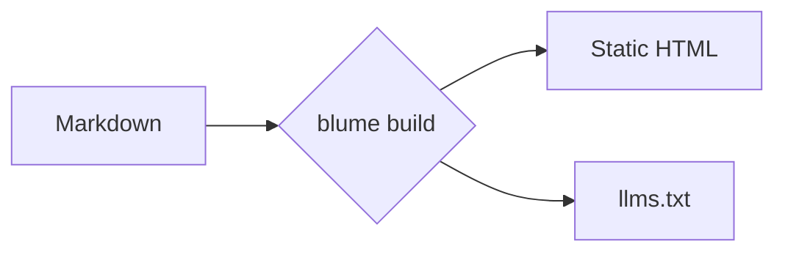
````

Os diagramas são renderizados no cliente, então este é um recurso exclusivo do MDX, e a biblioteca Mermaid é carregada apenas em páginas que incluem um. O restante desta seção é uma galeria de tipos comuns — veja a [documentação do Mermaid](https://mermaid.js.org/intro/) para a lista completa.

### Fluxograma


### Diagrama de sequência

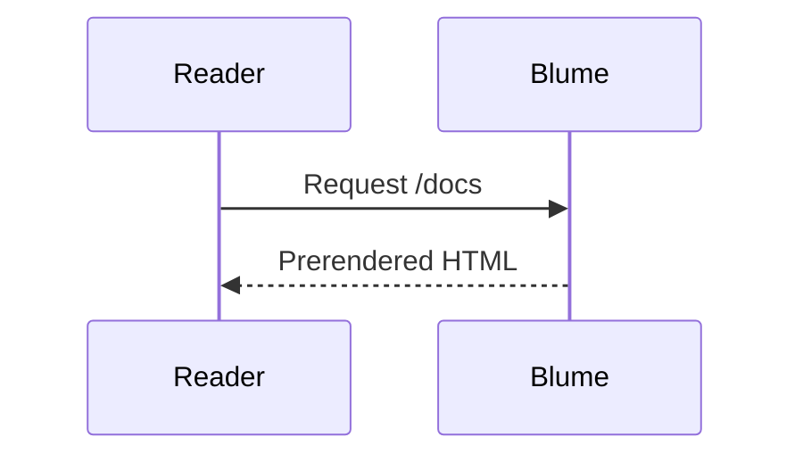

### Diagrama de classes

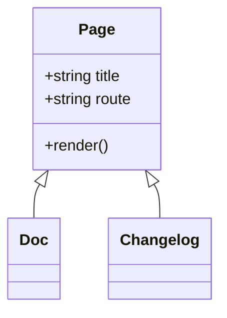

### Diagrama de estados

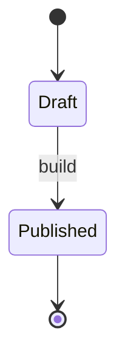

### Entidade-relacionamento

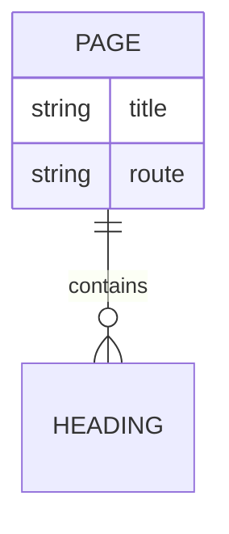

### Jornada do usuário

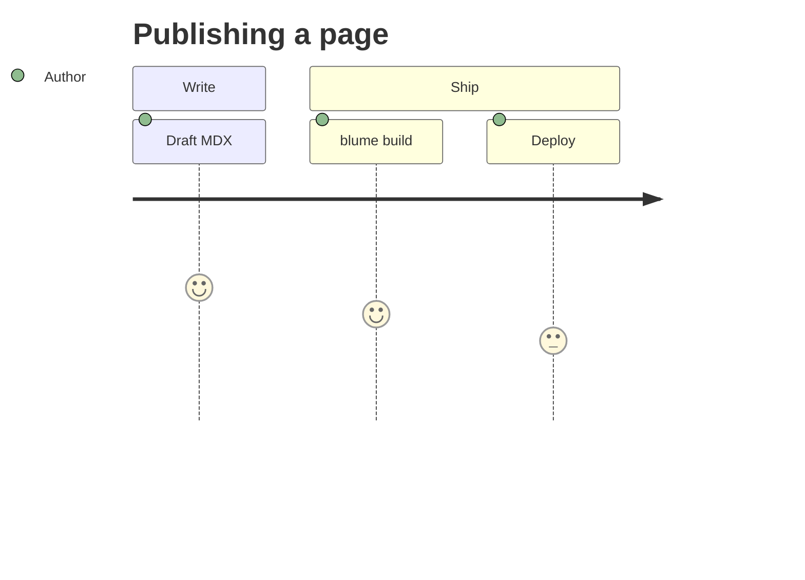

### Gantt

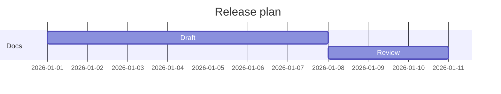

### Grafo do Git

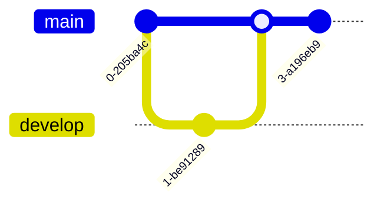

### Gráfico de pizza

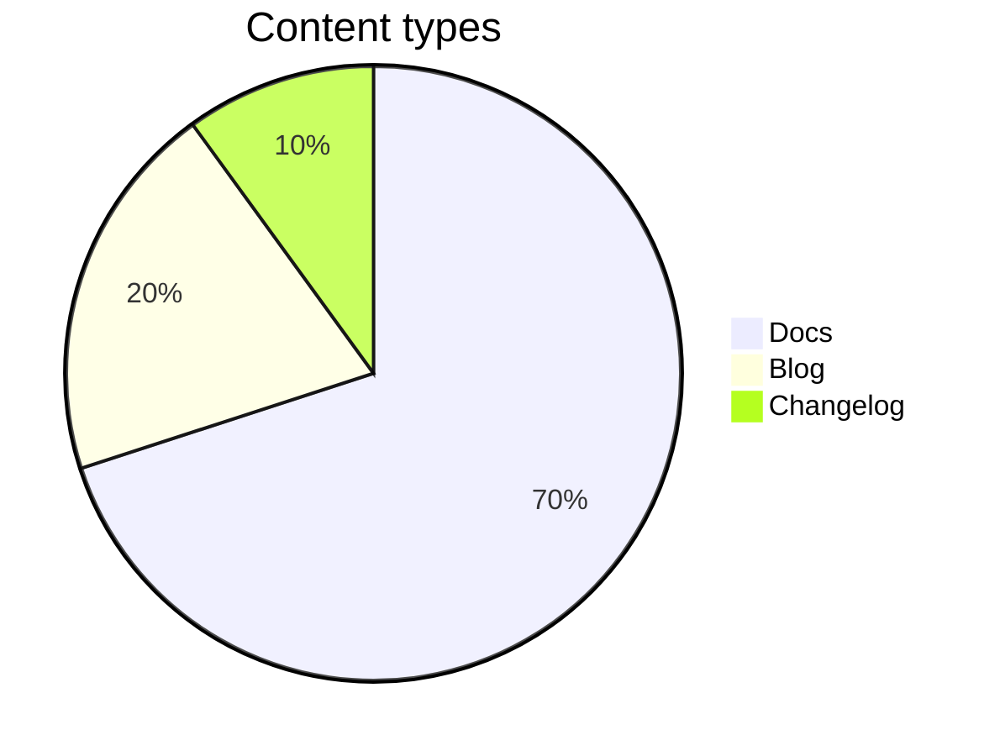

### Mapa mental

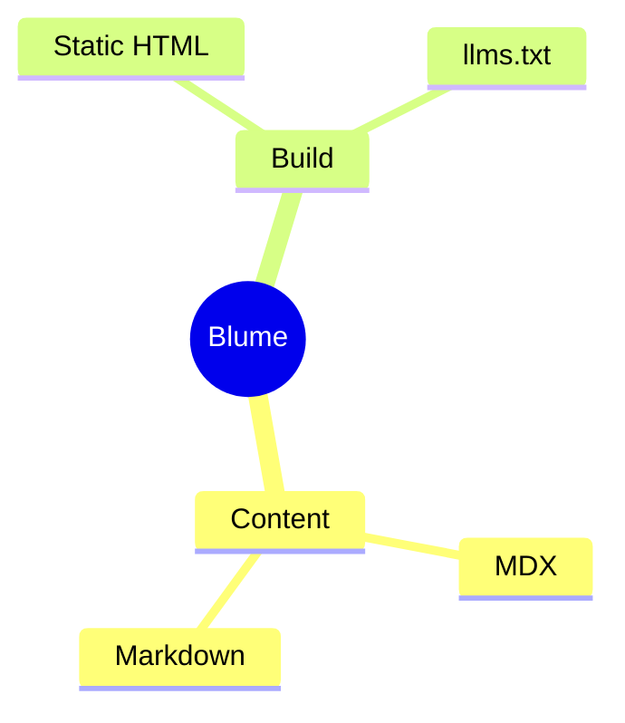

### Linha do tempo

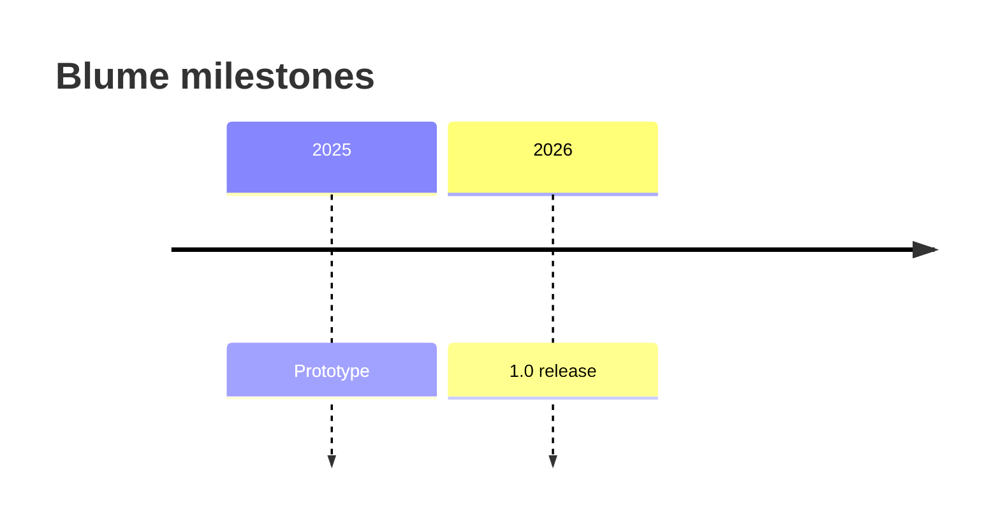

## Avisos

Os avisos chamam a atenção do leitor para contexto, conselhos ou riscos. Escreva-os como diretivas `:::type`; adicione um título entre colchetes, como `:::warning[Atenção]`. As diretivas são um recurso exclusivo do MDX — em um arquivo `.md` uma linha `:::note` permanece como texto literal.

### Nota

Contexto neutro e complementar que o leitor deve ter em mente.

:::note
O Blume regenera `.blume/` a cada execução — nunca o edite manualmente.
:::

```md
:::note
Blume regenerates `.blume/` on every run — never edit it by hand.
:::
```

### Dica

Um atalho útil ou uma boa prática que não é obrigatória, mas facilita a vida.

:::tip
Defina `deployment.site` para que os sitemaps e as imagens do Open Graph usem URLs absolutas.
:::

```md
:::tip
Set `deployment.site` so sitemaps and Open Graph images use absolute URLs.
:::
```

### Sucesso

Confirme um resultado positivo ou que uma etapa foi concluída como esperado.

:::success
Sua documentação foi compilada com sucesso e está pronta para publicação.
:::

```md
:::success
Your docs built successfully and are ready to deploy.
:::
```

### Aviso

Sinalize algo que exige cuidado para evitar um erro ou comportamento inesperado.

:::warning[Atenção]
Mudar para `output: "server"` exige um adaptador antes que você possa publicar.
:::

```md
:::warning[Heads up]
Switching to `output: "server"` requires an adapter before you can deploy.
:::
```

### Perigo

Destaque uma ação destrutiva ou disruptiva que não pode ser desfeita com facilidade.

:::danger
`blume eject` é um passo sem volta — o projeto Astro gerado passa a ser seu.
:::

```md
:::danger
`blume eject` is a one-way step — the generated Astro project becomes yours.
:::
```

### Info

Um aparte informativo; um padrão flexível quanto a aliases que soa neutro.

:::info
O tema principal não envia nenhum JS de framework do lado do cliente.
:::

```md
:::info
The core theme ships no client framework JS.
:::
```

Os nomes `caution`, `error`, `important` e `warn` são aceitos como aliases de `warning`, `danger`, `note` e `warning`, respectivamente.

## Matemática

Renderize LaTeX com o KaTeX como blocos centralizados — útil para documentação científica ou com muita matemática. Envolva uma fórmula em `$$…$$`:

$$
\int_0^\infty e^{-x^2}\,dx = \frac{\sqrt{\pi}}{2}
$$

```md
$$
a^2 + b^2 = c^2
$$
```

:::note
A matemática funciona apenas em bloco e está ativa automaticamente — escreva `$$…$$` e ela é renderizada; não escreva nenhuma e a folha de estilo do KaTeX nunca é enviada. Não existe matemática inline com `$…$`: um `$` isolado (moeda, variáveis de shell, código) é sempre mantido como texto literal, então não há delimitador para escapar nem configuração para alternar. A matemática é um recurso exclusivo do MDX. Os nomes de classe dentro da marcação renderizada (`.katex-html`, `.katex-base`, …) são internos do próprio KaTeX, não um contrato de estilização que o Blume mantém — eles podem mudar quando o KaTeX for atualizado, então mire no wrapper `.katex-display` para estilos personalizados.
:::

## Pontuação inteligente

O Blume converte aspas retas e traços em equivalentes tipográficos enquanto você escreve, para que o texto pareça diagramado — sem exigir caracteres especiais.

"Aspas" ficam curvas, -- vira um travessão curto, --- um travessão longo e ... uma reticência.

```md
"Quotes" become curly, -- becomes an en dash, --- an em dash, and ... an ellipsis.
```
