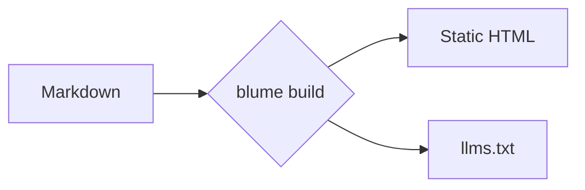

Blume renders standard Markdown and MDX with a curated, GitHub-flavored feature
set — no imports, no configuration. Write content the way you already do; this
page shows everything that's supported, with a live preview and the source for
each.

## Headings

Structure a page with headings. Blume renders your frontmatter `title` as the
page heading, so start your content at `##` — `##` through `####` become entries
in the table of contents and get linkable anchors.

```md
## Section

### Subsection

#### Detail
```

## Emphasis

Inline formatting for stressing words, marking deletions, and showing code or
keystrokes mid-sentence.

**Bold**, _italic_, ~~strikethrough~~, and `inline code`.

```md
**Bold**, _italic_, ~~strikethrough~~, and `inline code`.
```

## Superscript and subscript

For footnote markers, ordinals, and scientific or chemical notation inline.

E = mc^2^ and H~2~O.

```md
E = mc^2^ and H~2~O.
```

## Blockquotes

Set off a quotation, callout aside, or an editorial note from the surrounding
text.

> Documentation that's fast, AI-ready, and zero-config — down to the template.

```md
> Documentation that's fast, AI-ready, and zero-config — down to the template.
```

## Lists

Use unordered lists for unordered sets, ordered lists for sequences, and task
lists for checklists and roadmaps.

- Markdown-first authoring
- Static by default
  - Opt into server features
- Own your output

1. Install Blume
2. Write a page
3. Ship it

- [x] Scaffold the project
- [ ] Write the first guide

```md
- Markdown-first authoring
- Static by default
  - Opt into server features
- Own your output

1. Install Blume
2. Write a page
3. Ship it

- [x] Scaffold the project
- [ ] Write the first guide
```

## Tables

Tabulate structured data — config options, comparison matrices, parameter lists.
Use colons in the divider row to align columns.

| Command       | Description           | Output  |
| ------------- | --------------------- | :-----: |
| `blume dev`   | Start the dev server  |    —    |
| `blume build` | Build the static site | `dist/` |

```md
| Command       | Description           | Output  |
| ------------- | --------------------- | :-----: |
| `blume dev`   | Start the dev server  |    —    |
| `blume build` | Build the static site | `dist/` |
```

## Links and images

Link to other pages or external sites. Images accept any path under `public/` or
a remote URL.

Read the [quickstart](/docs/quickstart) to get started.

```md
Read the [quickstart](/docs/quickstart) to get started.


```

Content images are click-to-zoom by default — readers can click any image to open
it in a lightbox. Turn this off with `markdown: { imageZoom: false }` in
`blume.config.ts`, or opt a single image out with `data-no-zoom`.

## Horizontal rule

Separate major shifts in topic within a long page.

---

```md
---
```

## Code blocks

Fenced code blocks are syntax-highlighted with a header showing the language and
a copy button. Add a **title** after the language — typically a filename — and it
replaces the language label in the header.

```ts blume.config.ts
import { defineConfig } from "blume";

export default defineConfig({
  title: "My docs",
});
```

````md
```ts blume.config.ts
import { defineConfig } from "blume";

export default defineConfig({
  title: "My docs",
});
```
````

### Line numbers

Append `lineNumbers` to render a line-number gutter — on its own or alongside a
title:

```ts server.ts lineNumbers
import { serve } from "blume";

serve({ port: 3000 });
```

````md
```ts server.ts lineNumbers
import { serve } from "blume";

serve({ port: 3000 });
```
````

## Package install

A `package-install` block turns a single install command into a tabbed snippet
for npm, pnpm, yarn, and bun — so readers copy the one that matches their setup.

```package-install
npm i blume
```

````md
```package-install
npm i blume
```
````

## Diagrams

A `mermaid` block renders a [Mermaid](https://mermaid.js.org) diagram — flowcharts,
sequence diagrams, and more — straight from text. Diagrams follow the active color
theme and re-render when it changes.



````md

````

Diagrams render on the client, so this is an MDX-only feature, and the Mermaid
library loads only on pages that include one.

## Callouts

Callouts pull a reader's attention to context, advice, or risk. Write them as
`:::type` directives; add a title in brackets, like `:::warning[Heads up]`.

### Note

Neutral, supporting context the reader should keep in mind.

:::note
Blume regenerates `.blume/` on every run — never edit it by hand.
:::

```md
:::note
Blume regenerates `.blume/` on every run — never edit it by hand.
:::
```

### Tip

A helpful shortcut or best practice that isn't required but makes life easier.

:::tip
Set `deployment.site` so sitemaps and Open Graph images use absolute URLs.
:::

```md
:::tip
Set `deployment.site` so sitemaps and Open Graph images use absolute URLs.
:::
```

### Success

Confirm a positive outcome or that a step completed as expected.

:::success
Your docs built successfully and are ready to deploy.
:::

```md
:::success
Your docs built successfully and are ready to deploy.
:::
```

### Warning

Flag something that needs care to avoid a mistake or surprising behavior.

:::warning[Heads up]
Switching to `output: "server"` requires an adapter before you can deploy.
:::

```md
:::warning[Heads up]
Switching to `output: "server"` requires an adapter before you can deploy.
:::
```

### Danger

Call out a destructive or breaking action that can't easily be undone.

:::danger
`blume eject` is a one-way step — the generated Astro project becomes yours.
:::

```md
:::danger
`blume eject` is a one-way step — the generated Astro project becomes yours.
:::
```

### Info

An informational aside; an alias-friendly default that reads as neutral.

:::info
The core theme ships zero client JavaScript.
:::

```md
:::info
The core theme ships zero client JavaScript.
:::
```

The names `caution`, `error`, `important`, and `warn` are accepted as aliases for
`warning`, `danger`, `note`, and `warning` respectively.

## Math

Render LaTeX with KaTeX for formulas in prose or as centered blocks — useful for
math-heavy or scientific docs. Inline math goes in `$…$`; block math in `$$…$$`.

The Pythagorean theorem is $a^2 + b^2 = c^2$.

$$
\int_0^\infty e^{-x^2}\,dx = \frac{\sqrt{\pi}}{2}
$$

```md
The Pythagorean theorem is $a^2 + b^2 = c^2$.

$$
\int_0^\infty e^{-x^2}\,dx = \frac{\sqrt{\pi}}{2}
$$
```

:::note
Math is opt-in because `$` is common in prose and code. Enable it with
`markdown: { math: true }` in `blume.config.ts`.
:::

## Smart punctuation

Blume converts straight quotes and dashes to typographic equivalents as you
write, so prose reads like it was typeset — no special characters required.

"Quotes" become curly, -- becomes an en dash, --- an em dash, and ... an ellipsis.

```md
"Quotes" become curly, -- becomes an en dash, --- an em dash, and ... an ellipsis.
```
