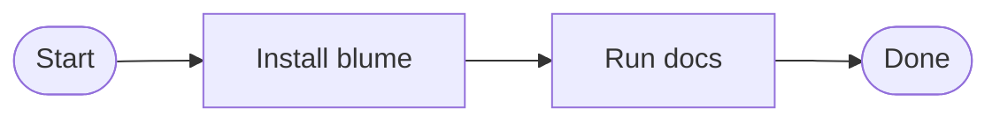

import SharedSnippet from "/snippets/shared-note.mdx";
import InstallSnippet from "/snippets/install-command.md";
import ParentSnippet from "/snippets/nested-parent.mdx";
import { installCommand, packageName } from "/snippets/custom-variables.mdx";
import { JSXSnippet } from "/snippets/jsx-snippet.jsx";

This page intentionally uses Mintlify-style component syntax. It is a fixture for the swap test, not a polished guide.

## Snippet imports

<SharedSnippet />

Imported variables from an MDX snippet: **{packageName}** installs with <code>{installCommand}</code>.

<InstallSnippet packageName="@acme/flowers" />

<ParentSnippet label="nested snippet content" />

<JSXSnippet label="JSX snippet import rendered" />

<div className="not-prose rounded-md border border-emerald-200 bg-emerald-50 px-4 py-3 text-sm font-medium text-emerald-950">
  Raw MDX HTML keeps React-style className.
</div>

Inline math renders when `styling.latex` is enabled: $E = mc^2$.

:::note[Note]
Supplemental information.
:::

:::info[Info]
Helpful context.
:::

:::tip[Tip]
Recommended path.
:::

:::warning[Warning]
Potentially risky action.
:::

:::success[Check]
Successful outcome.
:::

:::danger[Danger]
Destructive action.
:::

<Callout type="info" title="Custom callout" icon="key" iconType="regular">
  A callout with explicit type, icon, and iconType props.
</Callout>

<Callout
  type="tip"
  title="SVG callout"
  icon={
    <svg viewBox="0 0 24 24" width={16} height={16}>
      <path d="M12 2l2.6 6.8L22 9.2l-5.7 4.7L18 21l-6-3.9L6 21l1.7-7.1L2 9.2l7.4-.4L12 2z" />
    </svg>
  }
  color="#7C3AED"
>
  A callout with a custom SVG icon prop.
</Callout>

Status <Badge icon="circle-check" color="green" tooltip="Current release">stable</Badge>

<Badge icon="clock" color="orange" size="sm" stroke>
  queued
</Badge>

<Badge icon="lock" color="gray" shape="pill" disabled>
  private
</Badge>

<Badge
  icon={
    <svg viewBox="0 0 24 24" width={12} height={12}>
      <circle cx="12" cy="12" r="9" />
    </svg>
  }
  color="purple"
>
  custom svg
</Badge>

<Accordion>
  <AccordionItem
    id="first-accordion"
    title="First accordion"
    description="Uses Mintlify props"
    icon="book-open"
    defaultOpen
  >
    Accordion content renders inside a native disclosure.
  </AccordionItem>
  <AccordionItem title="Second accordion">
    More accordion content.
  </AccordionItem>
</Accordion>

<Tabs defaultTabIndex={1} borderBottom sync={false}>
  <Tab id="npm-install" title="JavaScript" icon="leaf">
    ```bash npm install blume ```
  </Tab>
  <Tab id="pnpm-install" title="Python">
    ```bash pnpm add blume ```
  </Tab>
</Tabs>

<CodeGroup dropdown>

```javascript helloWorld.js
console.log("Hello World");
```

```python hello_world.py
print("Hello World")
```

</CodeGroup>

<CodeGroup>

```javascript helloWorld.js
console.log("Synchronized JavaScript example");
```

```python hello_world.py
print("Synchronized Python example")
```

</CodeGroup>



<CardGroup cols={2}>
  <Card
    title="Quickstart"
    icon="text-align-start"
    iconType="solid"
    href="/quickstart"
    cta="Open quickstart"
  >
    Link to another page.
  </Card>
  <Card title="External" icon="arrow-up-right" href="https://blume.dev" arrow>
    Link to an external page.
  </Card>
  <Card title="Warning card" type="warning">
    A typed card with the default warning icon.
  </Card>
</CardGroup>

<Columns cols={2}>
  <Column>
    <Card title="Left column" icon="panel-left">
      Column content.
    </Card>
  </Column>
  <Column>
    <Card title="Right column" icon="panel-right">
      Column content.
    </Card>
  </Column>
</Columns>

<Steps titleSize="h3">
  <Step title="Install" icon="rocket">
    Install the package.
  </Step>
  <Step title="Run">Start the local preview.</Step>
</Steps>

<Expandable title="Show details" defaultOpen>
  Expanded content.
</Expandable>

<Frame
  caption="A **Blume** logo displayed with a Markdown caption."
  hint="Use frames for visual context."
>
  
</Frame>

<Frame caption="Product demo">
  <video autoPlay aria-label="Autoplay frame example" />
</Frame>

<Icon icon="fa-solid fa-key" iconType="solid" size={20} /> Inline icon.

<Color variant="compact">
  <Color.Item name="blue-500" value="#3B82F6" />
  <Color.Item name="theme" value={{ light: "#FFFFFF", dark: "#000000" }} />
</Color>

<Color variant="table">
  <Color.Row title="Primary">
    <Color.Item name="primary-500" value="#16A34A" />
    <Color.Item name="primary-600" value="#15803D" />
  </Color.Row>
</Color>

<Tree>
  <Tree.Folder name="app" defaultOpen>
    <Tree.File name="layout.tsx" />
    <Tree.File name="page.tsx" />
    <Tree.Folder name="api" defaultOpen>
      <Tree.File name="route.ts" />
    </Tree.Folder>
  </Tree.Folder>
  <Tree.Folder name="lib">
    <Tree.File name="utils.ts" />
    <Tree.File name="db.ts" />
  </Tree.Folder>
  <Tree.Folder name="config" openable={false}>
    <Tree.File name="settings.json" />
  </Tree.Folder>
  <Tree.File name="package.json" />
</Tree>

<Panel title="Panel">Supplemental panel content.</Panel>

<Prompt
  description="Generate **clear**, *concise* documentation."
  icon="paperclip"
  iconType="solid"
  actions={["copy", "cursor"]}
>
  Update these docs for the latest API changes.
</Prompt>

<Tile title="Tile" description="A visual preview card" href="/quickstart">
  <Icon icon="book-open" size={28} />
</Tile>

<Tile
  title="Logo tile"
  description="Light and dark preview images"
  href="/quickstart"
>
  
  
</Tile>

<Tooltip
  headline="API"
  tip="Application Programming Interface: a set of protocols for software applications to communicate."
  cta="Read our API guide"
  href="/api-reference"
>
  API
</Tooltip>
documentation helps developers understand how to integrate with your service.

<Panel title="JavaScript">
  ## JavaScript setup

JavaScript-only view content.

```javascript
console.log("Hello from JavaScript");
```

</Panel>

<Panel title="Python">
  ## Python setup

Python-only view content.

```python
print("Hello from Python")
```

</Panel>

<Visibility for="web">Content visible on the web output.</Visibility>

<Visibility for="agents">
  Content intended for generated Markdown output.
</Visibility>

## Personalization

Welcome back, {user.firstName ?? "developer"}.
