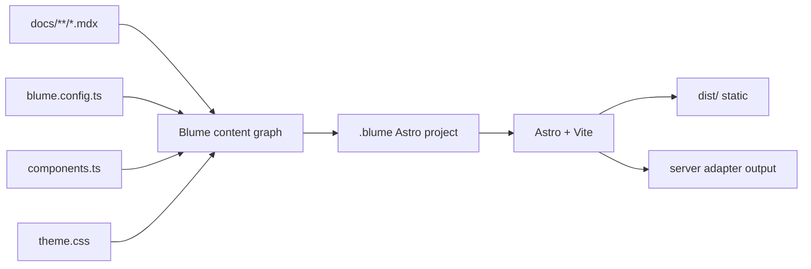

# Architecture

## Summary

Blume is a CLI-driven docs product built on Astro and Vite.

The user project contains content and optional customization files. The Blume CLI discovers those inputs, builds a content graph, writes a generated Astro runtime to `.blume/`, and runs Astro for dev or build.



## Layers

### 1. User project

The user owns:

- `docs/` or another configured content root
- optional `pages/**/*.astro`
- optional `blume.config.ts`
- optional `components.ts` or `components.tsx`
- optional `theme.css`
- optional public assets

No `src/`, `astro.config.mjs`, or app scaffold is required for the default path.

### 2. Internal core module

The `blume` package owns framework-independent docs logic through an internal core module:

- config loading and validation
- content discovery
- frontmatter and meta validation
- route manifest generation
- nav graph generation
- search index inputs
- diagnostics and error formatting
- deploy/build mode decisions

This layer should avoid importing Astro runtime APIs directly.

### 3. Internal Astro integration

The `blume` package owns the generated Astro project contract through an internal Astro integration module:

- generated `astro.config.mjs`
- Vite aliases to user files and Blume internals
- content and route virtual modules
- layouts and pages
- endpoint/action registration
- adapter configuration
- dev overlay integration

This is the bridge between Blume's docs graph and Astro's rendering model.

### 4. Internal theme and components

The `blume` package owns theme and component modules for:

- default docs layout
- sidebar, tabs, search, TOC, breadcrumbs, pagination
- callouts, cards, steps, code blocks, accordions, tabs, API blocks
- CSS variables and Tailwind v4 source styles
- island wrappers for interactive components

Default components should be Astro-first wherever possible. Interactive components can use React islands when that is the best-supported option.

### 5. Generated runtime

`.blume/` is a generated Astro project. It is safe to delete and regenerate.

Expected shape:

```txt
.blume/
  astro.config.mjs
  package.json
  tsconfig.json
  blume.manifest.json
  src/
    env.d.ts
    pages/
      [...slug].astro
      _og/[slug].png.ts
      api/
        ask.ts
    layouts/
      root.astro
    generated/
      config.ts
      content.ts
      components.ts
      routes.ts
      theme.css
```

The exact files can change, but the rule is stable: generated files are owned by Blume unless the user ejects.

## Request and build flow

### Dev

1. `blume dev` locates the project root.
2. Config is loaded with a typed loader.
3. Content, nav, pages, and component overrides are scanned.
4. `.blume/` is generated or updated.
5. Astro dev server starts against `.blume/astro.config.mjs`.
6. Vite watches user content and generated modules.
7. Blume invalidates only the affected graph segments.

### Static build

1. `blume build` generates the same runtime.
2. Astro runs in static output mode.
3. Content pages render to HTML.
4. Pagefind or the selected local search index is built from output HTML.
5. `dist/` is written as the deployable artifact.

### Server build

Server mode is enabled when config or features require it:

- Ask AI endpoint
- authenticated docs
- feedback persistence
- dynamic OG images
- preview routes
- server actions
- sessions

Server output uses Astro adapters. Vercel should be the best-supported first-party adapter path.

## Why Astro instead of Next

Blume's core site is content-heavy and static-first. Astro maps to that shape better:

- less client JavaScript by default
- Vite dev server and plugin ecosystem
- framework islands instead of an all-React app runtime
- clean static output
- server features when needed through adapters
- distance from the Fumadocs/Next category

Next-specific features have workable Astro equivalents:

| Need | Blume/Astro approach |
| --- | --- |
| Dynamic OG images | Astro endpoint using Satori or `@vercel/og` in server mode |
| AI chat | React island using `@ai-sdk/react` against an Astro endpoint |
| Server actions | Astro actions or typed endpoints |
| RSC-style server rendering | Astro server-rendered components and islands |
| Image optimization | Astro assets/image service plus adapter support |
| Analytics | Vercel Analytics or user-selected script integration |

## Package model

Blume should publish one package:

| Package | Responsibility |
| --- | --- |
| `blume` | CLI, config API, generated Astro runtime, content graph, components, theme, search, registry, migration tools |

Separate concerns should be internal modules inside the `blume` package, not separate public packages.

Suggested internal module layout:

| Internal module | Responsibility |
| --- | --- |
| `cli` | `blume` command entrypoint |
| `core` | Config, content graph, manifests, diagnostics |
| `astro` | Astro integration, generated runtime, endpoints |
| `mdx` | MDX/Markdoc compilation helpers and component mapping |
| `components` | Default component implementations and public component types |
| `theme` | CSS tokens, layout styles, theme build artifacts |
| `search` | Local search indexing and runtime adapters |
| `registry` | Add/eject/source registry helpers |
| `migrate` | Mintlify, Starlight, Fumadocs migration tools |

Public imports can use subpath exports from the same package:

- `blume`
- `blume/components`
- `blume/runtime`
- `blume/schema`

## Public API surface

The public surface should stay small:

- CLI commands
- `defineConfig`
- `defineComponents`
- component prop types
- meta/frontmatter schema
- registry command format
- migration commands

Generated runtime internals are not public API until ejected.
