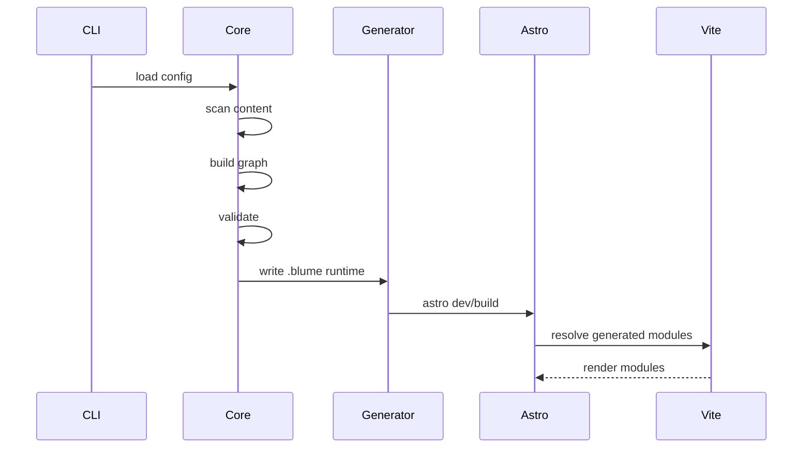

# Internals

## Core data flow



## Manifest

`blume.manifest.json` is the generated runtime contract between core and Astro.

Example:

```json
{
  "version": 1,
  "projectRoot": "/repo",
  "contentRoot": "/repo/docs",
  "output": "static",
  "routes": [
    {
      "id": "docs/index.mdx",
      "path": "/",
      "sourcePath": "/repo/docs/index.mdx",
      "moduleId": "blume:content/docs/index"
    }
  ]
}
```

The manifest should be stable enough for debugging but not treated as public API until documented.

## Generated modules

Generated modules can expose:

- `blume:config`
- `blume:routes`
- `blume:content`
- `blume:components`
- `blume:theme`
- `blume:nav`
- `blume:search`

Astro/Vite can resolve these through aliases or a Vite plugin inside the `blume` package's Astro integration module.

## Route rendering

Catch-all route:

```txt
.blume/src/pages/[...slug].astro
```

Responsibilities:

1. resolve `Astro.params.slug`
2. find route in manifest
3. load compiled content module
4. render inside Blume layout
5. return 404 when not found

Prerender behavior:

- static mode returns all known routes from `getStaticPaths`
- server mode can resolve at request time when needed

## Custom pages

User pages under `pages/**/*.astro` are mounted into the generated runtime.

Implementation options:

- copy files into `.blume/src/pages`
- virtual module wrappers
- Vite aliases back to user files

Preferred direction: alias/wrapper where possible so stack traces point to user source.

## Component registry internals

`defineComponents` normalizes user overrides into descriptors:

```ts
type HydrationMode = "load" | "idle" | "visible" | "media" | "only";

type ComponentDescriptor = {
  id: string;
  source: string;
  exportName?: string;
  client?: HydrationMode;
  framework?: "astro" | "react" | "vue" | "svelte" | "solid";
};
```

Generated Astro wrappers apply hydration directives for framework islands.

## Config types

Public config types should be exported from `blume`.

Internal normalized config should be stricter:

```ts
type NormalizedConfig = {
  projectRoot: string;
  contentRoot: string;
  pagesRoot: string | null;
  title: string;
  output: "static" | "server";
  adapter: "vercel" | "node" | "netlify" | "cloudflare" | null;
};
```

Keep public convenience separate from internal certainty.

## Diagnostics

Diagnostic shape:

```ts
type Diagnostic = {
  code: string;
  severity: "error" | "warning" | "info";
  message: string;
  file?: string;
  line?: number;
  column?: number;
  schemaPath?: string;
  suggestion?: string;
};
```

Diagnostics should be printable in:

- CLI
- Astro/Vite overlay
- JSON for editor integrations

## Caching

Cache layers:

- config hash
- content file hash
- route graph hash
- compiled MDX hash
- search index hash
- generated file hash

Only rewrite generated files when content changes. This protects Vite HMR performance.

## Eject internals

`blume eject` should:

1. generate a fresh runtime
2. copy `.blume/` into project source
3. replace generated aliases with normal relative imports where practical
4. preserve content root
5. add Astro scripts to `package.json`
6. stop treating copied files as generated

The command should show a file list and require confirmation.

## Server feature detection

Features that require server mode:

- Ask AI
- auth-gated pages
- dynamic runtime redirects
- request-aware personalization
- feedback persistence without static form provider
- dynamic OG images

Build should fail with a clear message if these are enabled in static mode.

## Versioning

Generated runtime files should include a Blume version marker.

The CLI can use it to:

- detect stale `.blume/`
- warn after package upgrades
- invalidate caches
- assist eject migrations
