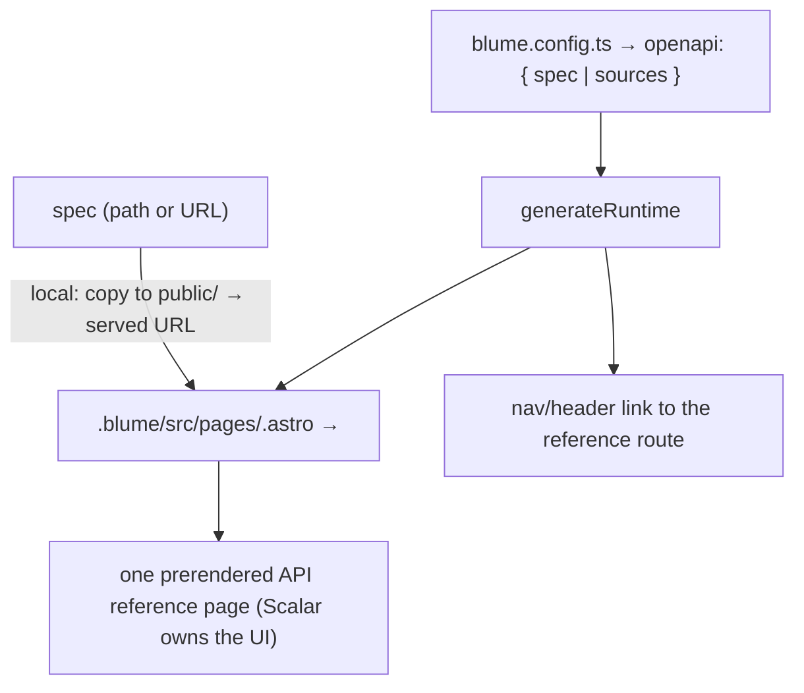

# OpenAPI & AsyncAPI

> **Update (2026-06-27):** the "Scalar-only, no native renderer" decision below
> is **revisited for OpenAPI** in `24-openapi-native.md` — a native reference
> renderer (real per-operation pages, in Blume's search/nav/llms/SEO) with the
> hard parsing layer delegated to libraries and Scalar kept as an optional
> playground island. AsyncAPI stays Scalar-only as described here.

## Goal

Let a project drop in an OpenAPI spec and get a solid, interactive API reference
— **without Blume building or maintaining an API-rendering UI**. API reference is
**not core to Blume's vision**, so we delegate the whole surface to
[Scalar](https://scalar.com) (`@scalar/astro`) rather than reinventing it. The
same integration renders **AsyncAPI** specs too — see the AsyncAPI section below.

See `15-content-types.md` for where API reference sits among content types. File
references are `packages/blume/...`.

## Decision

**Scalar-only, no native renderer, no toggle.** Scalar has solved the large
edge-case surface (complex schemas, `$ref`, auth flows, examples, a real
playground, multi-language samples) and ships an Astro integration. Building and
maintaining native parity isn't worth it for a non-core feature.

Accepted trade-offs (why this is fine here):

- The Scalar reference is a **self-contained embed** with its own sidebar,
  search, theme, and client JS — it does **not** weave into Blume's content
  graph, sidebar, Orama/Pagefind search, llms.txt, or per-operation OG/SEO.
- It renders to static HTML ahead of time (`renderMode: "static"`), so it's
  crawlable and fast on first paint, then hydrates for interactivity.
- It carries Scalar's design system, themed only as far as Scalar's options
  allow — it will not be pixel-identical to Blume's components.

These are acceptable precisely because API reference is a bolt-on, not a
first-class part of the docs experience. If that calculus ever changes, revisit
a native renderer (the prior native-rendering design is in git history).

## Removed

The earlier custom/native implementation is **deleted** (pre-launch, no
deprecation):

- `src/openapi/` (the `import.ts` importer + `types.ts`).
- The `blume import openapi` CLI command (`src/cli/commands/import.ts`) and its
  registration in `src/cli/index.ts`.
- API-only components `src/components/api/{Endpoint,AuthMethod,RequestExample,
  ResponseExample}.astro` and their imports/registration in
  `src/astro/templates.ts`.
- The `api` frontmatter object (`apiMetaSchema`) in `src/core/schema.ts`.

**Kept** (general-purpose, used across the docs — not OpenAPI-specific):
`ParameterTable` (moved to `src/components/content/`), `ParamField`,
`ResponseField`.

## How it works

A project points config at one or more specs; Blume generates a route in
`.blume/` that mounts Scalar's component, and adds a header/sidebar link to it.



- **Dependency:** add `@scalar/astro` (which pulls the Scalar API reference). It's
  only wired in when `openapi` is configured, so projects that don't use it don't
  pay for it.
- **Spec source:** a URL is passed straight to Scalar. A **local** path is copied
  into the build output (e.g. `public/`/the generated assets) and referenced by
  its served URL, since Scalar fetches the spec by URL.
- **Generated route:** `generateRuntime` writes
  `.blume/src/pages/<openapi.route>.astro` rendering
  `<ScalarComponent configuration={{ url, ...theme }} />` with `prerender` on, and
  registers a nav entry so the reference is discoverable. Multiple `sources` →
  either Scalar's multi-source config on one page or one route each.
- **Theming:** map Blume's accent/mode to the closest Scalar theme (or `none` +
  minimal CSS-var overrides) so it's not jarring. Best-effort, not exact.
- **Playground/auth:** provided by Scalar out of the box (servers, auth schemes,
  "try it") — nothing for Blume to build.

## Config schema (`src/core/schema.ts`)

A small `openapi` block (alphabetical, `.strict()`, `.default({})`, sorted keys),
wired into `blumeConfigSchema`/`ResolvedConfig`:

```ts
const openapiSourceSchema = z
  .object({
    label: z.string().optional(),   // nav/section label
    route: z.string().optional(),   // per-source route (default derived from openapi.route)
    spec: z.string(),               // local path or http(s) URL
  })
  .strict();

const openapiConfigSchema = z
  .object({
    enabled: z.boolean().default(false),
    route: z.string().default("/reference"),     // where the reference mounts
    sources: z.array(openapiSourceSchema).default([]),
    spec: z.string().optional(),                 // shorthand → sources: [{ spec }]
    theme: z.string().optional(),                // Scalar theme name; default mapped from Blume
  })
  .strict();
```

`spec` is shorthand for a single source. `enabled` defaults off; declaring
`openapi` is the opt-in.

## Integration notes

- **Search / llms / SEO:** the embed is opaque to these by design. Out of scope
  for v1. If we later want operations in Blume's own search/llms, we'd parse the
  spec ourselves to emit lightweight entries deep-linking into the Scalar page —
  not planned now.
- **React / zero-JS:** Scalar ships client JS for its interactivity, scoped to the
  reference route only. The rest of the site stays React-free / zero-JS by
  default.
- **Static vs server:** `renderMode: "static"` works for static builds. The
  playground's "try it" calls the target API from the browser (subject to CORS) —
  document that; no Blume proxy.

## AsyncAPI

Scalar renders **AsyncAPI** through the same component and the same `url` config
as OpenAPI (it auto-detects the document type), so AsyncAPI rides this exact
pipeline — no separate renderer, no extra dependency. Event-API reference is, if
anything, even less core to Blume than REST reference, so the same Scalar-only
decision and trade-offs (above) apply unchanged.

One caveat OpenAPI doesn't carry: **Scalar's AsyncAPI support is a work in
progress** ("not every part of the specification is rendered yet"; tracked in
[scalar/scalar#7080](https://github.com/scalar/scalar/issues/7080)). Today it
renders channels (title/address/description, server + protocol labels, address
parameters), nested send/receive operations, and messages as collapsible
accordions (protocol labels, headers, payload schemas), plus a Models section for
`components.schemas`. There is **no interactive playground yet** (no WebSocket /
publish "try it"), unlike the OpenAPI playground — acceptable, and it improves
upstream over time.

Config is a sibling `asyncapi` block with the **same shape** as
`openapiConfigSchema` (only the default `route` differs), reusing
`openapiSourceSchema` and sharing the route-generation code path:

```ts
const asyncapiConfigSchema = z
  .object({
    enabled: z.boolean().default(false),
    route: z.string().default("/events"),        // where the reference mounts
    sources: z.array(openapiSourceSchema).default([]),  // same source shape
    spec: z.string().optional(),                 // shorthand → sources: [{ spec }]
    theme: z.string().optional(),                // Scalar theme; default mapped from Blume
  })
  .strict();
```

Implementation is the same steps below, generalized: wire route generation behind
`config.openapi.enabled || config.asyncapi.enabled` (one code path, two config
namespaces). Because Scalar auto-detects, an AsyncAPI spec dropped straight into
`openapi.sources` would also just work — the separate block is only for clear
routes/nav labels (see Open questions).

## Implementation steps

1. Add `@scalar/astro` as a dependency; wire the alias/route generation behind
   `config.openapi.enabled` (and `config.asyncapi.enabled`).
2. `openapi` config block in `schema.ts` (above) + defaults/types.
3. `generateRuntime`: when enabled, copy local specs to served assets, write the
   `<ScalarComponent/>` page(s) under `.blume/src/pages/<route>`, and add the nav
   entry. Regenerated each run; nothing in the user's source tree.
4. Map Blume theme → Scalar theme.
5. Docs: a short "API reference" page under Configuration covering `openapi.spec`,
   `route`, multiple `sources`, and the playground/CORS note. (The legacy
   `blume import openapi` references in `reference/cli.mdx`, `introduction.mdx`,
   and the API component demos in `content/components.mdx` are already removed.)
6. Smoke-test against a sample spec (e.g. the Swagger Petstore URL).

## Open questions

- **OpenAPI/AsyncAPI config split.** A sibling `asyncapi` block (spec's default,
  route `/events`) vs folding AsyncAPI specs into `openapi.sources` (works since
  Scalar auto-detects) vs one merged `reference` block. Confirm the separate-block
  default.
- **Route vs in-layout.** Scalar renders a *full HTML document*, so the reference
  is its own route (e.g. `/reference`) rather than embedded inside Blume's docs
  shell (header/sidebar/TOC). Confirm that's acceptable, or investigate
  `renderMode: "client"` to mount it inside a Blume layout (more JS, less SSR).
- **Theme fidelity.** How close can Scalar's theming get to Blume's tokens before
  we decide "good enough"? Spec assumes best-effort named-theme mapping.
- **Multiple specs.** One Scalar page with a source switcher vs one route per
  spec. Spec leaves both open; default to one route per source.
