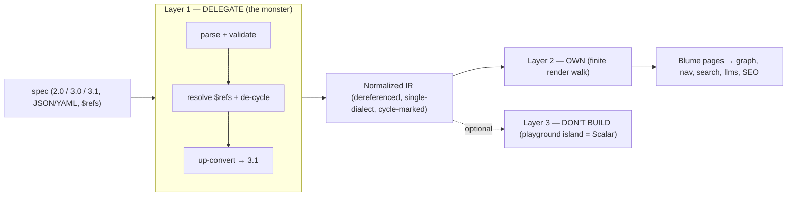

# Native OpenAPI reference

## Status

This revisits the **Scalar-only** decision in `21-openapi.md`. That doc deferred
the entire API surface to an embedded Scalar SPA and noted: "If that calculus
ever changes, revisit a native renderer." It has changed. The migration audit of
a real Mintlify API site (Quiver) showed the embed's structural cost is the
single biggest adoption blocker for API-first projects. This plan keeps Scalar
for what it's genuinely best at (the interactive playground) but moves the
**reference rendering** in-house so API operations rejoin Blume's content graph.

AsyncAPI stays on Scalar (see `21-openapi.md`) — it's even less core, and
Scalar's AsyncAPI rendering is still upstream-WIP. This plan is OpenAPI-only.

## Goal

Render an OpenAPI spec as **real Blume pages** — one per operation, with stable
URLs, sidebar entries, full-text search, `llms.txt` presence, and per-operation
SEO/OG — *without* taking on the genuinely unbounded parts of the OpenAPI
surface. The bet, validated in the blast-radius analysis below: the hard 80% is
a solved, maintained-dependency problem; the part we own is finite.

What the embedded-Scalar model loses today, and this recovers:

| Concern | Scalar embed (`21-openapi.md`) | Native reference |
| --- | --- | --- |
| Per-operation URLs | one route, opaque | `/reference/<tag>/<operationId>` real pages |
| Blume sidebar/nav | one link | operations grouped by tag in the tree |
| Orama/Pagefind search | invisible | each operation indexed |
| `llms.txt` / Ask AI | excluded | each operation included |
| Per-operation SEO/OG | one page | one per operation |
| Visual consistency | Scalar's design system | Blume components |

## The core principle: own only the finite layer

OpenAPI is three layers with wildly different cost curves. The whole strategy is
drawing the boundary so we own only the bounded one.



- **Layer 1 — parse / resolve / validate / version-normalize.** The genuine
  monster: `$ref` resolution (internal/external/remote, refs in non-schema
  positions), **circular references**, and three input dialects with different
  schema semantics (Swagger 2.0, OpenAPI 3.0's bespoke JSON-Schema subset, 3.1's
  full JSON Schema 2020-12). **We do not write any of this.** It is a solved
  problem owned by maintained libraries.
- **Layer 2 — the schema-tree render walk.** Walking a *resolved, normalized,
  single-dialect* tree and emitting tables/sections. A finite set of node types
  (~a dozen). **This is all we own.**
- **Layer 3 — playground / test-request / codegen.** Request building with every
  `style`+`explode` combo, OAuth2 flow execution, N-language code generation.
  Close to unbounded — and explicitly out of scope. Offered as an optional Scalar
  island, not rebuilt.

The "maintain edge cases forever" failure mode happens **only** if we hand-roll
Layer 1. Delegating it keeps the monster in someone else's repo.

## Layer 1 — delegated pipeline

Pick one maintained parser and one up-converter; treat them as the hard 80%.

1. **Parse + dereference + de-cycle + validate.** Candidates (pick one,
   confirm current maintenance at build time):
   - `@apidevtools/swagger-parser` / `json-schema-ref-parser` — battle-tested
     `$ref` resolution, bundling, and circular-ref handling.
   - `@scalar/openapi-parser` — Scalar's own, extracted and reusable.
   - `@redocly/openapi-core` — Redoc's bundler/linter core.
   - `@readme/openapi-parser` — ReadMe's fork with extras.
2. **Up-convert to a single dialect (3.1).** `swagger2openapi` for 2.0→3.0, then
   a 3.0→3.1 pass. This collapses the dialect blast radius from **three to one** —
   the renderer only ever sees 3.1. Record the original version for display.
3. **Output:** a fully dereferenced document with cycles marked (not expanded),
   normalized to 3.1, ready to lower into our IR.

Everything downstream sees clean, single-dialect, dereferenced data. Spec
messiness (YAML anchors, weird `$ref` targets, `nullable` vs `type: [...]`,
Swagger 2.0 `definitions`) is gone before our code runs.

## The normalized IR — the insulation layer

Do **not** render raw OpenAPI. Lower the normalized document into a small
internal model so the render walk never touches OpenAPI quirks directly. This is
the single most important design decision for keeping Layer 2 finite.

```ts
// openapi/ir.ts (new)
interface ApiReference {
  info: { title: string; version: string; description?: string };
  servers: ApiServer[];
  tagGroups: ApiTagGroup[];     // from tags + x-tagGroups
  operations: ApiOperation[];
  security: ApiSecurityScheme[];
}

interface ApiOperation {
  id: string;                   // operationId (or derived, stable)
  method: string;
  path: string;
  tag: string;
  summary?: string;
  description?: string;
  deprecated: boolean;
  parameters: ApiParameter[];   // path/query/header/cookie, already styled
  requestBody?: ApiBody;
  responses: ApiResponse[];
  security: ApiSecurityRef[];
  examples: ApiExample[];
}

// The render walk only ever sees this — never raw JSON Schema:
type SchemaNode =
  | { kind: "primitive"; type: string; format?: string; constraints: Constraints }
  | { kind: "enum"; values: unknown[]; names?: string[] }
  | { kind: "object"; properties: PropertyNode[]; additional?: SchemaNode | boolean }
  | { kind: "array"; items: SchemaNode; constraints: Constraints }
  | { kind: "union"; variant: "oneOf" | "anyOf"; options: SchemaNode[]; discriminator?: Discriminator }
  | { kind: "ref-cycle"; label: string; href: string }   // cycle stop, never expanded
  | { kind: "raw"; schema: unknown };                     // graceful-degradation escape hatch
```

`allOf` is **merged during lowering** (not a render node): the lowering step
flattens intersection chains into one `object` with combined properties /
`required` / constraints. The `raw` node is the escape hatch — anything the
lowering step can't model cleanly (exotic conditional/`unevaluated*` schemas)
becomes a `raw` node the renderer shows as a collapsible schema box. **Nothing
ever breaks; worst case it degrades.** That graceful-degradation contract is what
makes a *reference* tractable where a *playground* would not be.

## Layer 2 — the render walk (what we own)

A finite recursion over `SchemaNode`, plus operation/parameter/response chrome.
Reuses existing Blume content components (`Badge`, `Tabs`, `Callout`,
`Expandable`, `TypeTable`) so it's visually native.

| Node / element | Render |
| --- | --- |
| `primitive` | type + format + constraints inline (a `TypeTable` row) |
| `enum` | value list (+ `x-enumNames`/`names` when present) |
| `object` | property table; nested objects via `Expandable` |
| `array` | "array of <items>", recurse into items |
| `union` (oneOf/anyOf) | variant tabs; discriminator-driven labels when present |
| `ref-cycle` | a link to the named schema (stops infinite expansion) |
| `raw` | collapsible raw-schema box (degradation) |
| operation | method badge + path + summary/description + params + bodies + responses + auth |
| parameters | grouped table by `in` (path/query/header/cookie) |
| request/response bodies | media-type tabs → schema tree + examples |
| examples | `example`/`examples`/`externalValue`, rendered as code blocks |
| auth | per-operation security requirement display (AND/OR across schemes) |

The deceptively-hard items — `allOf` merge quality, discriminated-union UX, the
2020-12 long tail (`unevaluatedProperties`, `if/then/else`, `patternProperties`)
— all **degrade gracefully** to `raw` nodes rather than blocking. We invest in
polishing them over time (phase 6), not before shipping.

## Integration with the content graph (the payoff)

Operations become first-class Blume routes. Two ways to wire it, both viable:

- **Synthetic content source (preferred long-term).** Model the resolved
  operation set as a generated source under the `ContentSource` abstraction in
  `22-content-sources.md` — each operation is a `SourceEntry` whose body is the
  rendered reference. This reuses graph/nav/search/SEO/llms with zero special
  cases, and is the cleanest fit.
- **Direct route emission (simpler first cut).** In `generateRuntime`, emit one
  `.blume/` page per operation plus `PageRecord`-equivalents so they flow into:
  - **Routing/nav** — routes like `/reference/<tag>/<operationId>`; sidebar group
    per tag (honoring `tags` order and `x-tagGroups`).
  - **Search** — one `SearchDocument` per operation (`search/documents.ts`):
    title = summary, body = description + param/field names + path.
  - **llms.txt / Ask AI** — operations included in the generated corpus
    (`ai/markdown.ts`), so the assistant can answer endpoint questions.
  - **SEO/OG** — per-operation canonical + OG image, like any page.

Either way, the strategic win is identical: API operations are searchable,
deep-linkable, AI-indexed Blume pages — exactly the Quiver gaps closed.

## The hybrid playground (optional)

Keep the one genuinely-unbounded capability as an opt-in island rather than
rebuilding it: mount Scalar's API client (or `@scalar/api-client`) per operation
behind a config flag. Default off, so the site stays zero-JS / React-free unless
enabled; on, each operation page gets a "Try it" island scoped to that route. We
own the page, Scalar owns the request-builder edge cases (style/explode/OAuth2).

## Config schema

Extend the existing `openapi` block (`core/schema.ts`) rather than add a new one:

```ts
const openapiConfigSchema = z
  .object({
    enabled: z.boolean().default(false),
    route: z.string().default("/reference"),
    sources: z.array(openapiSourceSchema).default([]),
    spec: z.string().optional(),
    // NEW:
    renderer: z.enum(["native", "scalar"]).default("native"),
    playground: z.boolean().default(false),  // native + Scalar "try it" island
    theme: z.string().optional(),            // scalar renderer only
  })
  .strict();
```

`renderer: "scalar"` keeps the current embed available as a fallback for specs
the native renderer can't yet do justice (or for AsyncAPI). No breaking change:
existing `openapi` configs keep working; `native` becomes the default once it's
proven.

## Version support

- **3.1** — target dialect; rendered directly after lowering.
- **3.0** — up-converted to 3.1 (`nullable` → `type: [..., "null"]`, etc.).
- **2.0 (Swagger)** — up-converted via `swagger2openapi` → 3.0 → 3.1. Common
  enough (lots of older APIs) that dropping it would hurt migrations.

The original version is shown in the reference header; all rendering logic is
3.1-only.

## Maintenance surface (the honest accounting)

What stays a permanent cost, and how big:

- **Parser/up-converter bumps** — dependency maintenance, not spec
  implementation. Small.
- **Long-tail schema-shape reports** — "Scalar/Redoc renders this, Blume
  doesn't." A trickle, not a flood. Most trace to the parser lib (file upstream)
  or to a `raw`-node degradation we choose whether to promote to a real node.
  This is **triage**, bounded by the graceful-degradation contract.
- **Layer-2 polish** — allOf merge fidelity, discriminator UX, conditional
  schemas. Optional, incremental, never blocking.

What is explicitly **not** our cost: `$ref`/circular resolution, dialect
divergence, validation, request serialization, OAuth2 flows, codegen. Those live
in dependencies or the optional Scalar island.

## Non-goals

- A full interactive playground (delegated to the optional Scalar island).
- Request/response **serialization** correctness for every `style`/`explode`
  combo (that's the playground's job, not the reference's).
- Code-sample generation for N languages (punt, or surface `x-codeSamples` if the
  spec provides them; optionally lean on the island).
- Native AsyncAPI (stays on Scalar per `21-openapi.md`).

## Risks and open questions

- **IR fidelity** — the IR must be expressive enough that `raw` is rare in
  practice. Validate against large real specs (Stripe ~6MB / thousands of ops,
  GitHub, Petstore, a few messy community specs) early.
- **Performance at scale** — huge specs mean build-time render cost and a very
  long nav. Need lazy schema expansion, possibly paginated/collapsed nav per tag,
  and to confirm build times stay reasonable.
- **Circular refs in the renderer** — the parser resolves them, but lowering must
  insert `ref-cycle` stops correctly or the walk loops. Bounded but easy to get
  wrong; cover with tests.
- **Source-source vs direct emission** — decide whether to ride the
  `22-content-sources.md` abstraction now or emit routes directly first and
  migrate later. Leaning: direct first, converge on the source model.
- **Keep Scalar at all?** — hybrid (native pages + optional Scalar island) vs.
  fully native eventually. Hybrid is the safe default; full-native is a later
  call once the island's value is measured.
- **Theming** — native renderer uses Blume components (free), but matching the
  density/affordances users expect from Redoc/Scalar references takes design
  iteration.

## Phasing

1. **Layer 1 + IR.** Wire the parser + up-converter; lower into the normalized IR
   with `allOf` merge and `ref-cycle` stops. Pure data, no UI. Test against
   Petstore + Stripe + a messy spec.
2. **Operation pages + routing/nav.** Emit one page per operation, tag-grouped
   sidebar, stable URLs. Minimal rendering (summary/desc/params).
3. **Schema render walk (the 80%).** Full `SchemaNode` walk: objects, arrays,
   enums, unions, request/response bodies, examples, auth display.
4. **Graph integration.** Search documents, llms.txt entries, per-operation
   SEO/OG. This delivers the strategic payoff (the Quiver gaps).
5. **Optional Scalar playground island.** Behind `playground: true`.
6. **Long-tail polish.** allOf fidelity, discriminator UX, conditional/
   `unevaluated*` promotion from `raw` as demand warrants.

Roughly **~2 weeks to a solid Redoc-class read-only reference** (phases 1–4)
covering the 90%, because Layer 1 is delegated and Layer 2 is finite. Phases 5–6
are additive. The ongoing tax after that is dependency bumps + bounded triage —
not open-ended spec implementation.
