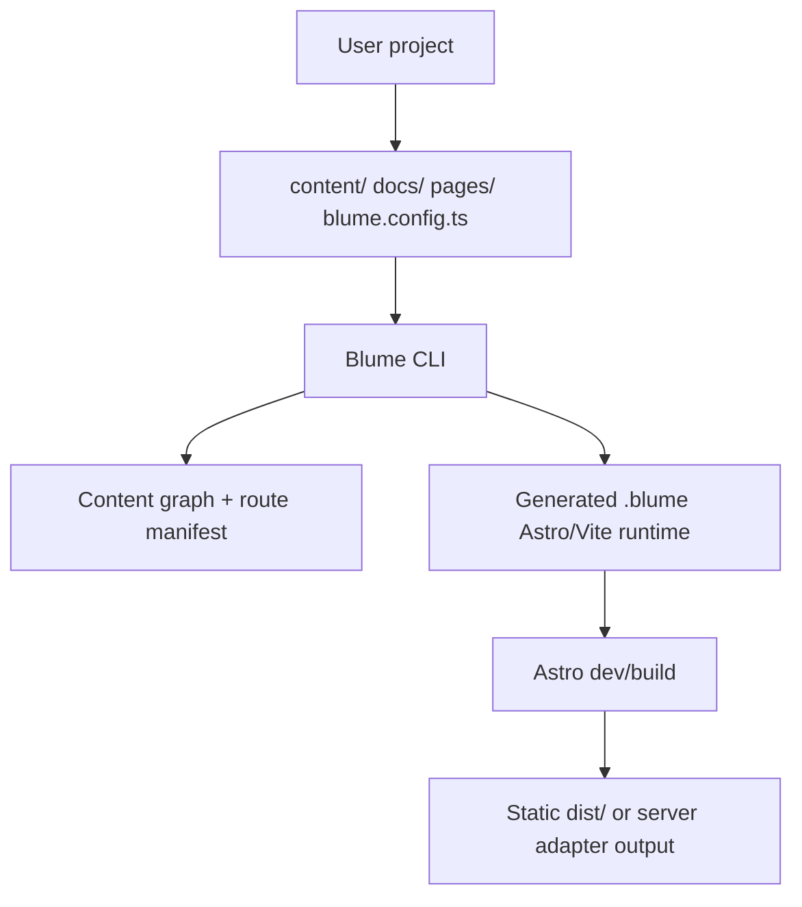

# Blume plan

This folder is the working product and architecture plan for Blume.

Blume is an open-source, markdown-first documentation system:

- drop Markdown, MDX, or Markdoc-style content into a project
- run `blume dev`
- Blume creates and runs an Astro/Vite docs runtime around that content
- get production-grade docs UI, navigation, search, theming, and components by default
- customize components, layouts, routes, and server features only when the project needs it

The guiding product sentence:

> Mintlify's authoring DX, Astro/Vite performance, and full open-source ownership.

## Decided direction

The plan is now centered on Astro + Vite, with Blume owning the docs layer.

Blume should not be a thin wrapper around Starlight, Fumadocs, or Next.js. Those projects are useful references, but Blume's core value is the productized docs experience: content conventions, component system, theme, navigation, search, AI hooks, and deploy behavior that work without boilerplate.

Astro gives Blume the default shape it wants:

- static-first output for most docs
- Vite dev speed and ecosystem gravity
- islands for interactive React/Vue/Svelte/Solid components
- server routes, actions, middleware, sessions, and adapters when dynamic features are needed
- a clean path to Vercel through `@astrojs/vercel`

## Plan index

| File | Purpose |
| --- | --- |
| `00-vision.md` | Product thesis, positioning, non-goals, and success criteria |
| `01-architecture.md` | Astro/Vite runtime architecture and package boundaries |
| `02-cli.md` | CLI commands, generated project lifecycle, dev/build behavior |
| `03-content-pipeline.md` | Content discovery, validation, compilation, routing, assets |
| `04-configuration.md` | `blume.config.ts`, config precedence, typing, defaults |
| `05-customization.md` | Components, pages, layouts, slots, islands, eject model |
| `06-navigation.md` | Sidebar, tabs, groups, page metadata, generated nav |
| `07-theming.md` | Design tokens, Tailwind v4, CSS variables, dark mode |
| `08-roadmap.md` | Milestones from prototype to public beta |
| `09-open-questions.md` | Decisions, risks, and product/technical unknowns |
| `10-components.md` | Built-in component inventory and implementation strategy |
| `11-ai.md` | Ask AI, generated docs, LLM-friendly outputs, MCP hooks |
| `12-internals.md` | Internal types, generated files, manifests, runtime contracts |
| `13-tooling.md` | Monorepo, package manager, linting, tests, release workflow |
| `14-quality.md` | Testing strategy, performance budgets, compatibility matrix |
| `15-content-types.md` | Docs, API reference, guides, examples, changelogs |
| `16-component-api.md` | Public component contracts and override API |
| `17-meta-schema.md` | Frontmatter and meta schema reference |
| `18-errors.md` | Error model, diagnostics, overlay, doctor output |
| `19-deployment.md` | Static/server builds, Vercel, adapters, search, redirects |
| `20-mintlify-migration.md` | One-time `blume migrate mintlify` — `docs.json` → `blume.config.ts`, idiomatic content rewrites, asset relocation |
| `21-openapi.md` | OpenAPI & AsyncAPI reference via an embedded Scalar renderer (no native UI) |
| `22-content-sources.md` | Pluggable content sources (remote MDX, Sanity, Notion) — the "Path B" loader abstraction |
| `23-i18n.md` | Internationalization — locale routing, per-locale nav/search, UI dictionaries, SEO (Mintlify/Fumadocs prior art) |
| `24-openapi-native.md` | Native OpenAPI reference — own the finite render layer, delegate parsing, keep Scalar as an optional playground (revisits `21`) |

## Core architecture in one diagram

## North-star constraints

- Zero-boilerplate authoring is the default path.
- Generated files are implementation detail until the user chooses to eject.
- Astro/Vite is the runtime; Blume is the docs product.
- Static output must be excellent before dynamic output gets fancy.
- React is first-class for interactive islands, but the core theme should not require React.
- The project should feel native on Vercel without being locked to Vercel.
- Customization should be source-level and inspectable, not hidden plugin magic.
- Migration from Mintlify, Starlight, and Fumadocs should be a serious adoption path.
